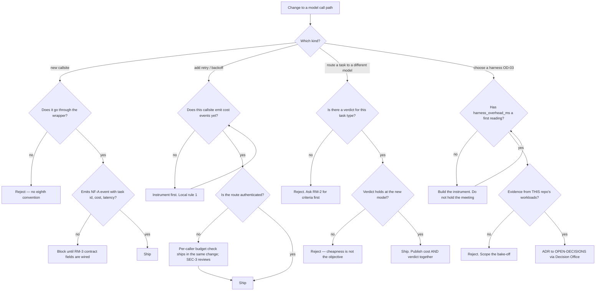

# Harness & Model Routing (RM-1) — Directive

Inherits the department's three rules ([[research-math-directive]]): *no pick from
repute* · *the instrument precedes the decision* · *author ≠ auditor*. This team's own
shape adds two, because both of its failure modes are ordering failures rather than
judgement failures.

## The two local rules

1. **A callsite gets cost instrumentation before it gets retry.** Never the reverse.
   Retry multiplies spend; on an unguarded route (`analytics/consultants.service.ts`,
   OD-20) it multiplies *unauthenticated* spend, and an uninstrumented callsite cannot
   show that it happened ([[harness-model-routing-premortem]] M4).
2. **A routing change is justified by a verdict, never by a price.** The verdict is
   authored by [[evaluation-doneability-charter]] and this team cannot edit it. A change
   that lowers cost and lowers the verified success rate is a regression presented as a
   win (premortem M3).

## Decision graph

## Decision rights

**Decides alone:**

- Wrapper internals: retry strategy, timeout values, circuit-breaker thresholds, the shape
  of the budget check.
- Which callsite migrates in which order (the first is fixed by rule: the most exposed
  one).
- The bake-off's candidate list and workload selection — **subject to** RM-2 owning the
  pass conditions and Red Team reviewing the design.
- Rejecting a new raw `fetch` to a model endpoint anywhere in the repo. That is a hard no,
  not a preference, and it is this team's only veto.

**Decides with a counterpart:**

| Decision | Counterpart | Form |
|---|---|---|
| Migration of the 7 callsites | [[engineering-charter]] | Deprecation date in the wrapper's own PR; adoption published weekly |
| Pass conditions for any bake-off or routing change | [[evaluation-doneability-charter]] | Committed before results exist; not editable here |
| Fields the wrapper emits | [[neural-footprint-instrumentation-charter]] | We emit into their contract |
| Budget enforcement on unauthenticated paths | [[security-charter]] SEC-3 | Named reviewer on the first three migrations |

**Cannot decide — escalates:**

- **OD-03 and OD-04.** Founder forks. This team supplies the table, not the verdict.
- **The routing seam** with `[[harness-model-routing-charter|aio-model-routing]]`. Not ours to settle; the interim
  answer is one shared wrapper.
- **The per-caller budget number**, and whether the wrapper fails open or closed when it
  is exceeded. Failing closed stops a runaway and also removes a feature mid-service from
  a paying restaurant — a product call.
- **Fork F-5** — whether the seven callsites are in OD-03's scope at all.

## Escalation trigger

Same day, into `questions.md` and `OPEN-DECISIONS.md` where a decision is implied:

1. **An OD-03 conversation starts while `harness_overhead_ms` reads unmeasured.**
2. **`share_of_model_calls_through_wrapper` is omitted from the board for one close-time.**
   The metric disappearing is the signal, not the number being low (premortem M2).
3. **A new raw `fetch` to a model endpoint lands.** Count is 7; 8 is an escalation.
4. **Cost falls and verified success falls in the same close-time.**
5. **A second client-construction module appears** — the routing-seam tell (premortem M5).
6. **Retry is proposed for an unguarded callsite that emits no cost events.** Local rule 1.

## How this team handles being failed by RM-2

[[evaluation-doneability-charter]] can fail this team, by charter. When it does, the
response is one of exactly three, in writing, within the same close-time: *accepted and
reverted*, *accepted and scheduled*, or *disputed with the measurement that disputes it* —
filed to the founder or [[decision-office-charter]], never resolved here. Editing a golden
set, a threshold, or a pass condition in response to a failure is the single act this team
is structurally forbidden to perform.
