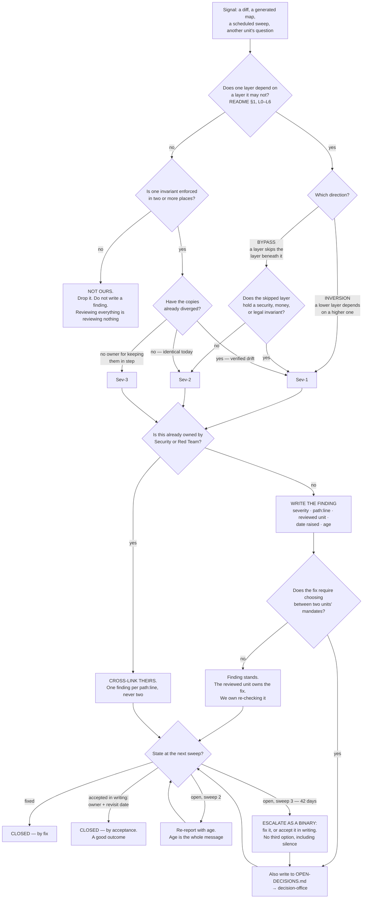

# Architecture Review — Directive

How *this* function decides. The shape is driven by one fact that makes it structurally
unlike every department in [[ORG_STRUCTURE]] §2: **this unit does not decide whether
anything gets built.** A department's directive is a set of gates on its own work. This
one has no work of its own to gate. Its decision graph answers a different question
entirely —

> *A signal arrived. Is it a layer violation, how bad, and what happens to the finding
> after it is written?*

— and the graph's terminal node is not `Ship`. There is no `Ship`. Every path ends in a
written finding whose fate is determined by **age**, not by approval. That is what
findings-only means when you draw it (OD-16, [ADR 0007](../../decisions/0007-org-structure.md)).

## The graph



**Read the graph for what it lacks.** There is no node where this function permits
something, no node where it withholds permission, and no node where a reviewed unit needs
anything from it in order to proceed. A department's directive is a series of gates
([[ai-orchestration-directive]] is explicitly that). This one is a **classifier followed
by a clock.** The only pressure it applies is that a finding gets visibly older, in public,
until somebody decides something — and *deciding to keep it* counts.

## The severity ladder

Severity is a node in the graph, so it needs a definition rather than a feeling. Severity
governs **how a finding is written**; it does **not** govern what happens next — age does.

| Sev | Definition | Founding instances |
|---|---|---|
| **Sev-1** | An **inversion** (lower layer depends on higher); or a **bypass carrying a security, money, or legal invariant**; or **two copies of one invariant that have already drifted apart**. The defect is live, not latent | AR-0, AR-1, AR-2, AR-4, AR-5 |
| **Sev-2** | A **bypass** where the invariant still holds and no divergence is verified. Structurally wrong, currently harmless, cheaper to fix now than at scale | AR-3 |
| **Sev-3** | Legal today, but the seam has **no owner** — nothing would notice if it drifted. Includes fixed defects retained as precedent | AR-6 |

**Why divergence is the Sev-1/Sev-2 line for duplicated invariants.** Two identical copies
of a rule are a maintenance cost. Two copies that have *already* diverged are a live defect
plus proof that nothing is keeping them in step — the second half being the part that
guarantees recurrence. AR-2 is Sev-1 on exactly this test: 19 patterns in TypeScript,
8 in Python, under a comment asserting they are identical.

**What severity is deliberately not.** It is not a queue position and not a deadline. A
Sev-1 and a Sev-3 raised the same day escalate on the same day, 42 days later. This is
counter-intuitive and intentional: severity is the reviewer's opinion, and letting the
reviewer's opinion set the clock is how a review function starts negotiating its own
importance. Age is a fact.

## Decision rights

| Decision | Decided by | Constraint it cannot escape |
|---|---|---|
| Is this a layer violation? | **Here.** The function is the rule's interpreter | Must cite `path:line` and the specific layer pair. *"This feels wrong"* is not a finding |
| What severity? | **Here** | Per the ladder above, published, not per-incident |
| Whether a finding is **written at all** | **Here** — and the right to *not* write is used often | Per-sweep finding budget. A sweep that produces a dozen findings has stopped ranking |
| Whether a finding **escalates** | **Nobody.** Age decides, at 42 days | Not a judgement call, by design. See [[architecture-review-premortem]] #1 |
| Whether the finding gets **fixed** | The reviewed unit | Ours is not a vote. We do not have one |
| Whether it is **accepted instead of fixed** | The reviewed unit, **in writing**, with an owner and a revisit date | Acceptance in writing **closes** the finding and counts as success. Acceptance in conversation closes nothing |
| Whether anything **ships** | Not this function. Not any advisory function | Findings-only is **LOCKED** (OD-16). A finding never gates a merge |
| Whether the **L0–L6 rule itself** should change | Proposed here, decided by the founder | Amendment to [[README]] §1; a supersede, not a side effect |
| Whether a finding belongs to Security or Red Team instead | Whichever function's **metric it moves** | If it moves two, **one** writes and the other cross-links. Never two |

**The one decision right this function conspicuously does not have — and must not acquire.**
It cannot block, cannot approve, cannot require sign-off, and cannot make a merge
conditional on anything. If a reviewed unit ever needs this function's agreement to
proceed, the function has stopped being independent and started being a dependency, and
every subsequent finding is contaminated by the reviewed unit's need to get past it.
Independence and authority are traded against each other here, and
[ADR 0007](../../decisions/0007-org-structure.md) chose independence deliberately.
The cost of that choice is [[architecture-review-premortem]] #1, which is why the clock
exists.

## The clock, stated once, precisely

```
sweep 1   finding written, age 0
sweep 2   +14d   re-reported with age. No new argument, just the number
sweep 3   +28d   re-reported with age
sweep 4   +42d   escalated to OPEN-DECISIONS.md as a binary:
                 FIX IT  ·  or  ·  ACCEPT IT IN WRITING (owner + revisit date)
```

Three properties worth being explicit about:

1. **Acceptance is a real close, and a respectable one.** *"Yes, `apps/web` keeps reading
   Postgres directly until the guest app ships; owner [[client-surfaces-charter]]; revisit
   2027-02-01"* closes AR-1 and counts in
   `arch.findings_closed_by_decision_ratio`. This function is not trying to be agreed with;
   it is converting **silent deferral into recorded deferral**.
2. **Nothing about the escalation is discretionary.** Not the reviewer's, not the reviewed
   unit's, not negotiable by either. A discretionary clock is not a clock.
3. **Age is reported even when nothing else is.** If a sweep is skipped, the ages still
   advance and the skipped sweep is reported as skipped on
   [[architecture-review-agenda-board]]. A missed sweep must not silently reset anything.

## Escalation trigger

Escalate to `OPEN-DECISIONS.md` — via [[decision-office-charter]] — when any of:

1. **A finding reaches 42 days open.** Automatic, per the clock. The escalation text is
   always the same binary and never a re-argument of the finding.
2. **A fix requires choosing between two units' mandates.** AR-4 is this: whether the
   `decision_log`/`api_spend` join key belongs to
   [[neural-footprint-instrumentation-charter]] or to the harness is not ours to settle,
   and a finding that cannot be actioned by its recipient is an escalation on arrival, not
   at day 42.
3. **The same `path:line` is cited by two advisory functions in one sweep.** This is a
   Sev-2 finding **against the advisory layer itself**, and it is filed like any other.
   [[architecture-review-premortem]] #3.
4. **Three findings against the same seam are all argued down on design grounds.**
   The escalation is *"amend [[README]] §1"* — **not a fourth finding.** A rule defeated
   three times on its merits is evidence about the rule.
   [[architecture-review-premortem]] #4.
5. **A finding this function declined to write turns out to have mattered.** Rare and
   important: the finding budget exists to keep the channel readable, and its cost is
   false negatives. When one lands, the escalation is about the budget, not the incident.
6. **2026-11-24, the merge trigger.** If fewer than half of raised findings have closed by
   decision — fixed *or* accepted — the escalation is *"merge Architecture Review into
   [[decision-office-charter]]."* Raised by this function, about this function.
   [[architecture-review-premortem]] #1(c).

Findings **from** [[red-team-charter]] about this function's own structure land in
[[architecture-review-agenda-full]] §Questions and are aged on the same clock as everything
else. A review function exempt from review is the premise of this whole layer, inverted.
