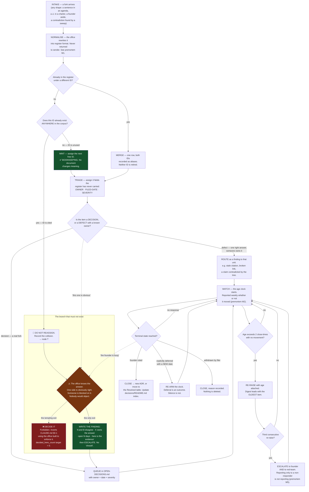

# Decision Office — Directive

How *this* function decides. The shape is a **conveyor with one forbidden exit**:
items enter, get normalised, get an owner and an age, get watched, and leave — and
the single branch that does not exist is the one where the office resolves the item
itself. Everything about the graph below is ordinary routing except node **T**,
which is the whole design.

## The decision graph

**Read the dotted edges.** They are the realistic entry points into node T, and
neither is a mistake anyone makes on purpose. `G ⇢ T` is *"this is a defect, not a
decision — one side is obviously right, so routing it is the same as resolving it."*
`N ⇢ T` is *"the founder is busy and this has been open eleven weeks."* Both are the
same argument, and both are correct about the facts and wrong about the authority.
The graph draws them because a temptation nobody drew is a temptation nobody
audits.

## Decision rights

### Decided here — bookkeeping only, no escalation

These change **no document's meaning**. That is the test, and it is the entire
basis for calling them decisions at all.

- **Minting an unused identifier** for an unregistered fork.
- **Normalising** an intake into register format: rewriting prose into
  question · why-it-matters · what-unblocks-it.
- **Assigning an owner** — meaning *the unit that must produce what unblocks the
  item*. Never the decider; the decider is always the founder.
- **Assigning a filed date and a severity band.**
- **Recording an alias** when one fork was filed twice under two IDs. Both IDs
  survive; neither is retired.
- **Recording a contradiction or a stale citation** and naming the owning unit.
- **Cadence and format of our own digests, sweeps, and reports.**
- **Declining a deliverable, team, or headcount** offered to this office. Declining
  never accrues authority; accepting can.

### Not decided here — escalates to `OPEN-DECISIONS.md`

Per [`CLAUDE.md`](../../../CLAUDE.md) §0.1: nothing is decided until it is written
in `.planning/decisions/`. That rule binds this office first.

| Escalation | Why it is not ours |
|---|---|
| **Reassigning any cited identifier** | See the bright line below. |
| **The authoritative fork-numbering scheme itself** | The office proposes one; adopting it changes what 83 OD-23 citations and 45 OD-24 citations mean. Founder ratification, filed as a new register row. |
| Which of two contradicting numbers is right — 375 vs 573 insight types | [[analytics-bi-charter]] owns the answer. We own the fact that both are published. |
| **OD-25** — Research & Math or Skills runs the weekly skill-health job | Two documents, two owners. Breaking the tie is deciding, however obvious it looks. |
| **OD-26** — should every unit carry a merge trigger symmetric with its split trigger | Named in the register as *"likely a Decision Office standing rule."* **A standing rule this office writes for itself is a rule with no author but the enforcer.** Founder call; we supply the 11-vs-3 count. |
| **OD-C6** — reparenting [[standards-verification-charter]] under this office | Declining is ours. *Accepting* is not, and the charter declines in writing. |
| Whether a dated trigger's condition is *met* vs whether the unit should therefore **fold** | We report the reading. The fold is the unit's and the founder's. |
| Whether the loop YAML block moves into frontmatter so Dataview can query it | A corpus-wide format change across 396 blocks in 82 files. Architecture-shaped; [[architecture-review-charter]] and the founder. |
| Any finding that implies an L0–L6 layer violation | [[architecture-review-charter]] ([[ORG_STRUCTURE]] §3). |

### The bright line

> **The office may assign an unused identifier to an unregistered fork.
> It may never reassign an identifier already cited elsewhere in the corpus.**

The test is mechanical and anyone can run it: `grep -rn "OD-nn" .planning/`. If the
count outside the register is zero, minting is bookkeeping. If it is non-zero,
renumbering silently rewrites what other units' documents mean — a decision about
their work, made without them, by the office whose founding rule forbids exactly
that.

This is why the first assignment ships as a **proposal**. OD-30 describes the
collision as *"mechanical to fix"* and, at the level of text editing, it is. It is
not mechanical at the level of authority: OD-23 alone is cited **83 times** across
five divisions, in three different meanings.

## Escalation trigger

Escalate immediately, without waiting for the weekly cycle, when any of these fire:

1. **`decisions.decided_here_count` becomes non-zero.** [[decision-office-premortem]]
   M3 has arrived. Report to the founder **and** [[red-team-charter]] — an office
   self-reporting its own authority creep to itself is the arrangement
   [[ORG_STRUCTURE]] §3 rejects.
2. **An intake is returned to its filer for reformatting.** M1's first instance.
   Target for `decisions.intake_returned_count` is **0**, not "low".
3. **Two consecutive triages close zero rows while opening more than two.** This is
   [[0002-documentation-first-operating-mode]] §Consequences' own revisit
   condition — *"the register's founder-queue grows faster than it drains"* —
   arriving. It escalates as an ADR-0002 review, not as a status update.
4. **A dated trigger fires and produces no outcome within two close-times.** M5.
   `triggers.fired_but_unactioned_count` and `triggers.dated_unwatched_count` are
   reported as two separate numbers, always together; collapsing them is the
   failure itself. First live test: **2026-11-24**, when four triggers land at once.
5. **A finding written by this office contains the word "should".** A finding
   states what disagrees, who owns it, and how old it is. "Should" means a
   recommendation crossed into a ruling. Greppable, and checked in the quarterly
   self-audit.
6. **This office is offered an executing team, a headcount, or a deliverable that
   is not a finding.** OD-C6 is the live instance and is already declined; a
   *second* instance means the boundary is being tested rather than misunderstood,
   and that is a founder conversation.
7. **A month passes in which this office ships registry mechanics and closes zero
   rows.** M4. The reconciliation is time-boxed to two close-times; if it has not
   reached the founder by then it is abandoned, not extended.

## Tie-break rule

When escalating and resolving look equally reasonable, **escalate**.

The asymmetry is not caution, it is arithmetic on two unequal errors. Escalating
something that turned out obvious costs the founder one line of reading. Resolving
something that turned out to be a real fork costs a decision made outside
`.planning/decisions/` — which, by non-negotiable #1, means it *did not happen*,
while the corpus behaves as though it did. The first error is a minor tax paid
once. The second is an undetectable defect in the exact substrate this office is
responsible for, made by the only unit nobody else is auditing for it.

These two errors are not symmetric and must never be averaged into one judgement
call.
