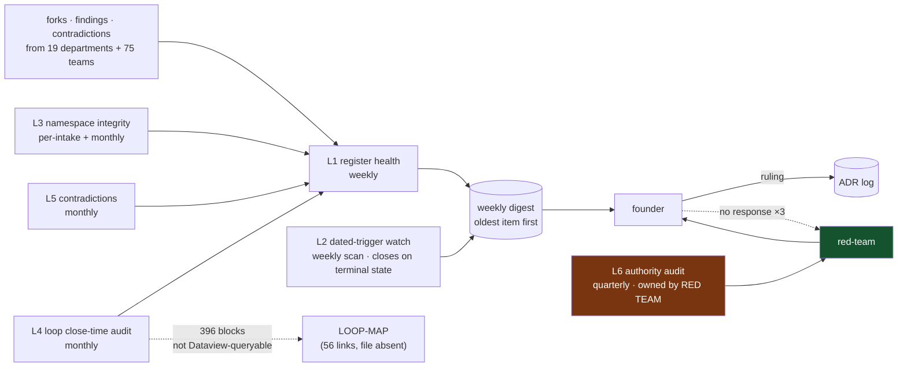

# Decision Office — Loops

Every loop names its close-time. A loop that cannot state how fast it closes is a
diagram, not a loop ([[ORG_STRUCTURE]] §5).

> **This unit's loops are unusual in one respect:** its subject matter *is*
> close-time. L1 measures whether decisions close; L4 audits whether **396 other
> loop blocks** name a close-time they actually meet. A loop about close-times that
> misses its own close-time is the loudest possible failure, so every close-time
> below is short and unconditional. **None is blocked on another unit.** That is
> deliberate — the two loops that matter most (L1, L2) need only a text file, a
> date, and a calendar, and a governance function that cannot run without someone
> else's telemetry has no business auditing anyone.

---

## L1 — Register health: does the queue drain faster than it fills?

**The loop this function exists for.** [[0002-documentation-first-operating-mode]]
§Consequences names the exact revisit condition — *"the register's founder-queue
grows faster than it drains for a sustained period"* — and **nobody has ever
computed it.** L1 is that computation, on a clock.

```yaml
type: loop
id: decision-register-health
owner: decision-office
measures: [decisions.open_count, decisions.intake_rate, decisions.close_rate_per_week, decisions.median_age_days, decisions.oldest_age_days, decisions.unowned_count]
changes: [decisions.register_triage, decisions.owner_assignment, decisions.digest_ordering]
inputs_from: [all-units, founder]
outputs_to: [founder, red-team, architecture-review]
close_time: weekly
status: proposed
```

**Close-time is weekly and unconditional** — the digest ships in weeks where
nothing moved. A number that appears only when it changes cannot embarrass anyone
([[decision-office-premortem]] M2).

**What it emits, in this order, every week:**

1. **The single oldest open row**, restated in full, with its age in days. Same row
   next week if it has not closed. Repetition is the mechanism.
2. `open_count` **and** `intake_rate` **on the same line.** Reported together
   because a falling queue is M1 (tollbooth) and a rising queue is M2 (passive
   list), and one number cannot distinguish them.
3. `close_rate_per_week` and `median_age_days`.
4. `unowned_count` — **target 0**.

**Baseline, 2026-08-24:** `open_count` **23**; `unowned_count` **23**;
`median_age_days` **undefined** (no row carries a filed date); `close_rate` **0/wk**
(all 12 resolved rows share one date, which is a burst, not a rate).

**First action of the first cycle** — retroactive owner and filed-date on all 23
rows. Neither field changes what any row *means*, so both are bookkeeping under
[[decision-office-directive]] §Decision rights.

**Escalation:** two consecutive cycles closing zero while opening >2 escalates as an
**ADR-0002 review**, not a status update. That is the ADR's own written tripwire.

---

## L2 — Dated-trigger and escalation watch

Nothing in this corpus currently reads a calendar. Six dated triggers exist; **six
are unwatched.** Four of them land on the same day.

```yaml
type: loop
id: dated-trigger-watch
owner: decision-office
measures: [triggers.dated_unwatched_count, triggers.fired_but_unactioned_count, triggers.days_to_next_trigger]
changes: [decisions.escalation_queue, decisions.digest_ordering]
inputs_from: [skills, sales, legal, partnerships-integrations, all-units]
outputs_to: [founder, red-team, the-owning-unit]
close_time: weekly scan; per-trigger the loop closes only on a terminal state (actioned · deferred-with-a-new-date · withdrawn)
status: proposed
```

**Two close-times, deliberately.** The *scan* is weekly. The *trigger* closes when
the escalated item reaches a terminal state — never when the escalation is sent.
Escalation is not an outcome; that conflation is
[[decision-office-premortem]] M5, and it is the failure mode most compatible with
findings-only authority.

**The watch list, as of 2026-08-24:**

| Fires | Unit | Condition | Written at |
|---|---|---|---|
| **2026-11-24** | [[skills-charter]] | <5 committed, firing skills → collapse into [[ai-orchestration-charter]] | `skills-directive.md:76` |
| **2026-11-24** | [[skill-harvesting-charter]] | Registry <15 **and** no scheduled trigger re-evaluation | `skill-harvesting-premortem.md:90` |
| **2026-11-24** | [[sales-charter]] | `DEP-06` unchecked **and** `verified_dollars_recovered == $0` → fold into [[growth-charter]] | `sales-schedule.md:25` |
| **2026-11-24** | [[outbound-engine-charter]] | No landed credit → folds with Sales | `outbound-engine-schedule.md:29` |
| **≈2026-11-22** (day 90) | [[supplier-distributor-network-charter]] | CM-F3 **and** OD-21 open with `pi.live_counterparties == 0` | `supplier-distributor-network-directive.md:124` |
| **second quarterly review** | [[legal-charter]] | Merge trigger, written as the counter to OD-26's ratchet | `legal-premortem.md:38-41` |

**`days_to_next_trigger` is reported weekly from now**, not from November. A trigger
first mentioned the week it fires has not been watched; it has been noticed.

**Two metrics, never one.** `dated_unwatched_count` counts triggers with no watcher
(today: 6, dropping to 0 when this loop runs). `fired_but_unactioned_count` counts
watched triggers whose firing produced nothing. Collapsing them lets the office
drive one number to zero while the org's structures ratchet on regardless — M5,
exactly.

**Related, and separately tracked:** OD-26 asks whether every unit must carry a
merge trigger symmetric with its split trigger. Corpus count today: **split triggers
in 11 documents, merge triggers in 3** (`legal-loops.md:149`). This loop supplies
that count; it does not propose the rule, because a standing rule written by its
own enforcer has no independent author ([[decision-office-directive]]).

---

## L3 — Fork-namespace integrity

```yaml
type: loop
id: fork-namespace-integrity
owner: decision-office
measures: [decisions.namespace_collisions, decisions.unfiled_fork_count]
changes: [decisions.id_allocation, decisions.alias_table]
inputs_from: [all-units]
outputs_to: [founder, all-units]
close_time: per-intake for allocation; monthly sweep for unfiled forks
status: proposed
```

**Per-intake, because a collision is only cheap before it is cited.** OD-24 cost
nothing on the day it was minted twice; it is now cited by **25 documents** across
three divisions carrying two meanings — and **177 of 581 documents cite at least one
of the six colliding IDs.**

**Today: 7 namespaces.** Canonical `OD-nn`; `OD-19…24` local to
`technology.md:842-848`; `OD-20…24` local to `product.md:858-862`; `OD-C1…C5`
(`corporate.md:494-498`, correctly namespaced) extended in-session to `OD-C6…C8`
and unfiled; `CM-F1…F6` (`commercial.md:629-634`, correctly namespaced);
`F-1…F-5` (`intelligence.md:515-521`, ambiguous against `CM-Fn`); and `DEP-06`,
unit-local, cited by **34 documents**.

**The monthly sweep** greps `01-org/` and `02-advisory/` for identifier-shaped
tokens absent from the register — that is how `OD-C6/C7/C8` would have surfaced the
week they were written instead of a month later.

**Hard constraint carried from [[decision-office-directive]]:** this loop **mints**
unused IDs and **never reassigns** cited ones. Its output on the collision is a
proposal to the founder plus the alias table above — not an edit.

---

## L4 — Loop close-time audit across the corpus

```yaml
type: loop
id: loop-close-time-audit
owner: decision-office
measures: [loops.undefined_close_time_count, loops.status_vocabulary_drift, loops.blocked_count, loops.exists_ratio]
changes: [decisions.escalation_queue, loop_map.contents]
inputs_from: [all-units]
outputs_to: [founder, architecture-review, the-owning-unit]
close_time: monthly
status: proposed
```

**Monthly, not weekly** — a loop's close-time changes when a unit rewrites its
loops, which is a monthly-scale event. Weekly would produce three identical reports
and hit [[foundation-README]] §6's own three-runs-no-action downgrade rule.

**Baseline: 396 loop blocks in 82 `*-loops.md` files.**

| Reading | Count | Note |
|---|---|---|
| `status: proposed` | 356 | 90% of the org's feedback loops are forecast |
| `status: provisional` | 63 | |
| `status: blocked` | 25 | |
| **`status: exists` / `running`** | **4 / 2** | Six loops in the entire org are running |
| `close_time: weekly` / `monthly` | 129 / 111 | |
| Free-text close-times | ~60 distinct phrasings | e.g. *"weekly, escalating after 3 consecutive close-times"* — informative, unparseable |
| **Explicitly undefined** | **≥1** | `privacy-engineering-loops.md:188` — `close_time: UNDEFINED — must be set by the decision that creates this loop`, with `owner: UNASSIGNED — escalated` and `outputs_to: [decision-office]` |
| **Status-field drift** | **1** | `content-production-loops.md:58` — `status: monthly`, a cadence written into the status field |

**`privacy-engineering-loops.md:188` is the reference case for this whole
function**: an unowned loop with no close-time, addressed to this office, written
before this office existed. It is a real inbox item, not an illustration.

**The finding this loop must carry every month until it is answered.**
[[ORG_STRUCTURE]] §5 calls the loop block *"machine-readable frontmatter."*
[[OBSIDIAN_VAULT]] §4 makes Dataview *"the anti-sprawl mechanism in practice."*
Every generator — **including this one** — wrote the block inside a fenced
` ```yaml ` region in the document **body**. Dataview indexes frontmatter and inline
fields, not fenced code. **None of the 396 blocks is queryable, and neither are the
six on this page.** Consequences: `[[LOOP-MAP]]` (56 inbound links, file absent)
cannot be a Dataview query; L4 runs by grep; and the executable-later promise of
OD-12 rests on a format that is not currently machine-readable. Moving 396 blocks
into frontmatter is a corpus-wide change and therefore **not this office's to
make** — filed, not fixed.

---

## L5 — Contradiction and stale-citation register

```yaml
type: loop
id: contradiction-register
owner: decision-office
measures: [corpus.contradiction_count, corpus.stale_citation_count, corpus.contradiction_median_age_days]
changes: [decisions.finding_queue, decisions.owner_assignment]
inputs_from: [standards-verification, all-units]
outputs_to: [the-owning-unit, founder, knowledge-documentation]
close_time: monthly
status: proposed
```

**Scope discipline.** [[standards-verification-charter]] verifies claims across the
whole corpus; that is theirs. This loop carries only the subset where **two
documents disagree about something a decision depends on**, or where a citation
that a decision rests on no longer says what it claims. The register **records the
disagreement and names the owner. It never picks a side** — picking is
[[decision-office-premortem]] M3.

**Open at founding — all four verified against the live tree this session:**

| # | Contradiction | Owner | State |
|---|---|---|---|
| C1 | **375** insight types (`LLM_INSTRUCTION_PROMPTS.md:166`) vs **573** (`YC_WEDGE_PLAN.md:324`) | [[analytics-bi-charter]] | Unowned before today |
| C2 | Weekly skill-health job: Research & Math (`foundation/README.md:269`) vs Skills (`technology.md:497-498`) | Founder | **= OD-25**, registered, still unowned |
| C3 | Seating Density widget absent (`UX_PATHS_CATALOG.md:49`) vs shipped (`:1013`) — **one file contradicting itself.** `SeatingDensityPanel.tsx` exists and is mounted in `Reports.tsx`, so `:49` is stale | [[ux-path-burn-down-charter]] | Verdict evident; **still routed, not ruled** |
| C4 | `.claude/skills/` asserted absent by ~99 `schedule.md` files (**OD-C7**) vs present, tracked, with `README.md` and zero `SKILL.md` | [[skills-charter]] | **An open item half-closed by a side effect, unnoticed** |

**C3 is the loop's own hardest test.** One side is demonstrably right; a file on
disk settles it. Routing rather than ruling costs an extra cycle and buys the one
thing this office cannot rebuild once spent — the standing to tell any unit that
nothing is decided until it is decided together.

**Stale citations open at founding:** `YC_WEDGE_PLAN.md:401` cites
`ReceivingWorkspace.tsx:233,265`; live lines are `:400-401` and `:438-440`. The same
sentence claims `:92` defaults `invoiceQty` to `stockedQty`; `:168` reads
`useState<number | null>(null)`, and `stockedQty` seeds `acceptedQty` at `:174`.
**The citation did not merely drift — it inverted.** That is the argument for this
loop, from one file.

---

## L6 — Authority self-audit

The loop that watches the watcher. Its findings go **outward**, never back here.

```yaml
type: loop
id: decision-office-authority-audit
owner: red-team
measures: [decisions.decided_here_count, decisions.intake_returned_count, decisions.should_word_count, decisions.accepted_deliverable_count]
changes: [decision-office.charter, decision-office.directive]
inputs_from: [decision-office]
outputs_to: [founder, red-team]
close_time: quarterly
status: proposed
```

**`owner: red-team`, not `decision-office`** — the single most important field on
this page. [[ORG_STRUCTURE]] §3 scopes [[red-team-charter]] to *"decisions,
everywhere"*, and a decision made by the Decision Office is squarely in scope. An
office auditing its own authority creep is precisely the arrangement
[[ORG_STRUCTURE]] §3 was built to reject, and writing this loop as self-owned would
have been the first instance of the thing it audits.

**Targets, all zero:** `decided_here_count` · `intake_returned_count` ·
`should_word_count` (findings containing *"should"* — greppable) ·
`accepted_deliverable_count` (teams, headcount, or deliverables accepted by this
office; OD-C6 is the live offer and is declined in
[[decision-office-charter]]).

**Quarterly, and non-negotiably so.** Authority creep is cumulative and slow; a
weekly check would produce zeroes and be downgraded under
[[foundation-README]] §6's three-runs rule — deleting the audit through the
anti-sprawl rule would be an elegant way to lose the only external check on this
function.

---

## Loop dependency



**Read this as: five loops feed one weekly digest, and the sixth is pointed at the
office itself and held by someone else.** Every close-time above is met with a text
file, a grep, and a calendar. Nothing here waits on NF-A, on telemetry, or on
another unit shipping — which is the correct shape for the function that is
supposed to notice when everyone else is blocked.
