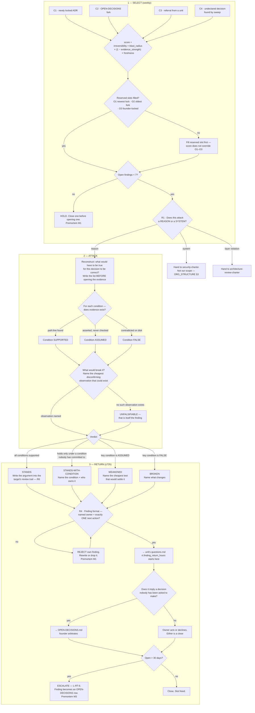

# Red Team — Directive

How *this* unit decides. Shape differs per unit by design.

Every other unit's directive is a **build graph**: work arrives, gets classified, gets
routed to a team, ships. This one is not, and the difference is the point. Red Team's graph
is **adversarial** — it takes a *decision* as its input and a *finding* as its output, and
every node in between is a test the decision either survives or does not. Nothing is built.
Nothing ships. The graph's job is to convert a belief into either a stronger belief with an
argument attached, or a named next step.

The graph has three phases, and they are strictly ordered because reversing them is the
characteristic way this work goes wrong:

1. **Select** — which decision, and why this one. An attacker with no queue attacks
   nothing; an attacker with an unsorted queue attacks whatever shouted loudest.
2. **Attack** — reconstruct *what would have to be true*, **then** look at the evidence.
   In that order. Reading the evidence first produces a search for confirmation, and this
   function's whole value is that it does not do that.
3. **Return** — a finding with one named owner and one named next action, back inside
   72 hours. Findings-only means the return leg is the only leg Red Team controls, so it
   is the only leg it is measured on.

## Why the graph is shaped this way

**"What would have to be true" comes before the evidence.** This is the one ordering
constraint that cannot be relaxed. Opening the files first and then asking whether the
decision is sound produces a search for confirmation, and the reconstruction step degrades
into narrating what was found. Writing the conditions blind is uncomfortable and slower and
is the only way the *absence* of evidence becomes visible — an ASSUMED condition looks
exactly like a SUPPORTED one if you never wrote down that it was a condition.

**"What would break it" is a separate node from the verdict.** A decision that nothing
could disconfirm is not a strong decision; it is an unfalsifiable one, and that is a
finding in its own right rather than a pass. The `UNFALSIFIABLE` path exists because the
most dangerous decisions in this corpus are the ones stated in a form that no observation
could contradict — see [[red-team-agenda-full]] T3 on ADR 0007, where "ambition over
capacity" is currently un-disconfirmable by construction.

**Four verdicts, not two.** *Stands* and *broken* alone would force every partially-sound
decision into one bucket or the other, and almost every real decision here is partially
sound. `STANDS-WITH-CONDITION` and `WEAKENED` carry most of the traffic, and they are the
two verdicts that generate a **next step** rather than a judgement — which is the founder's
stated requirement for this function (`ORG_STRUCTURE.md:61`).

**The cap sits before the gate, not after.** Selection is capacity-limited *first*, so the
scoring rule is forced to discriminate. If the cap were applied at the return stage, the
function would do seven attacks' worth of work and then throw some away.

## Decision rights

| Level | Decides | Examples |
|---|---|---|
| **Red Team** | Which decision is attacked, in what order, and when a finding is good enough to leave the function | Target order this cycle; rejecting its own finding for missing an owner; grading a condition ASSUMED rather than SUPPORTED |
| **Red Team** | The verdict — *stands · stands-with-condition · weakened · broken* | The verdict is an assessment, not an instruction. It carries no authority beyond being written down |
| **The reviewed unit** | Whether to act on a finding, and how | An owner may decline. A declined finding with a written reason is a **closed** finding and a good outcome |
| **[[decision-office-charter]]** | Whether an escalated finding enters `OPEN-DECISIONS.md`, and its ID | Red Team does not assign OD numbers — see R7 |
| **The founder** | **Every decision.** Including whether a broken decision stays broken | OD-23's revenue target; ADR 0007's document count; the NF-B erasure collision |
| **Nobody, ever** | Blocking, vetoing, or gating on a Red Team finding | Findings-only is locked (`0007-org-structure.md:48-52`, OD-16). A Red Team that can stop work will be routed around |

**What Red Team explicitly does not decide:** whether it is right. The verdict is a
written argument, and its only enforcement is that it is on the record. That is a weaker
authority than it sounds and a stronger one than it feels —
`0007-org-structure.md:84-88` records a recommendation that lost, and it is still the most
informative part of that ADR.

## Standing rules

**R1 — The reason/system test, applied before a target enters the queue.** *Does this
attack a reason or a system?* Systems go to [[security-charter]]; layer violations go to
[[architecture-review-charter]]. On a security topic the correct Red Team target is always
the decision underneath — *why the guard fails open*, *why a route class was secured by
each author remembering* — never the route itself. Code `path:line` may appear as
**evidence** in any finding; it may never be the **subject**. Counters
[[red-team-premortem]] M5.

**R2 — Referrals get no privileged lane.** All 82 inbound referral lines enter the same
scoring funnel as everything else. A referral proves a unit is worried, which is a signal
and not a priority; the unit most worried about itself is frequently not the unit most
wrong. Counters M4.

**R3 — The cap is 7 and it is not negotiable within a cycle.** To open an eighth finding,
close one. If the cap feels wrong, that is a decision — raise it as a fork, do not exceed
it quietly. Counters M1.

**R4 — Format rejection happens inside this function.** A finding leaves only with a named
owner and **exactly one** next action. Not three options, not "consider" — one action, and
"decide X" is a valid action when the next step genuinely is a decision. Two findings
against the same decision are two findings, not one finding with two steps.
`rt.finding_actionability` target is 100%.

**R5 — Findings are written as answerable questions, not verdicts to absorb.** *"This
holds only if X; X has never been measured; the cheapest measurement is Y"* is actionable.
*"This is risky"* is weather. The verdict labels exist for sorting; the body of the finding
is a question the owner can answer.

**R6 — A reaffirmation is only a success if it is written into the target's review trail.**
When a decision stands, the argument that failed against it goes into that ADR's review
trail — the `0001-mudavym-single-entity.md:50` pattern. An attack that produces no
review-trail row produced nothing, and a row that visibly says nothing is legible as
politeness. Counters M2.

**R7 — Red Team does not assign OD numbers, and does not stage them privately.** Escalated
findings go to [[decision-office-charter]], which owns the register and the IDs. This rule
exists because of an observed defect: eight decision-shaped items (`OD-C1`–`OD-C8`) live
only inside Corporate's unit documents and never reached `OPEN-DECISIONS.md`, `OD-C5`
alone being cited 38 times as though it were live. `OPEN-DECISIONS.md` OD-30 records the
same class from the Engineering generator. **Red Team must not add to it.** Where this
function's own documents name a proposed fork, they carry an `RT-F#` label that is
explicitly *not* an OD id, and [[red-team-agenda-full]] §Forks to register lists all of
them in one place for the Decision Office to take or reject.

**R8 — Every cycle attacks at least one founder-locked decision (O3).** A cycle that does
not is a filed finding against Red Team, recorded in [[red-team-agenda-board]]. Counters M2.

## Escalation trigger

A finding escalates from the unit's `questions.md` to `OPEN-DECISIONS.md` when **any** of:

| # | Trigger | Why it cannot rest with the unit |
|---|---|---|
| E1 | The verdict is **BROKEN** on a decision the unit does not own | The unit cannot unmake a decision made above it |
| E2 | The finding implies a **choice between two defensible options** | That is a fork by definition, and forks belong to the founder ([[0002-documentation-first-operating-mode]]) |
| E3 | The finding crosses **two or more units** | Nobody in the line can close it; the NF-B erasure collision spans Compliance, Research & Math, and Data |
| E4 | The finding is **open at 30 days** | L-RT-6. Ageing converts to a decision — including *"we accept this"*, which is a legitimate and better-than-silence outcome |
| E5 | The finding is against **advisory itself**, including Red Team | Self-review is not review. Goes straight to the founder |

Escalation is a **handoff, not an amplification**. The finding does not become more
authoritative by moving; it becomes visible to the only person who can close it.

## What this graph does not do

It does not verify implementations, run tests, scan endpoints, or grade controls. It does
not track close-times across the org — that is [[decision-office-charter]]. It does not
approve, and it cannot stop anything. Its entire product is **a written argument with a
next step attached**, and the honest measure of whether that is worth a chartered function
is the merge condition in [[red-team-charter]] §Entry and exit triggers.
