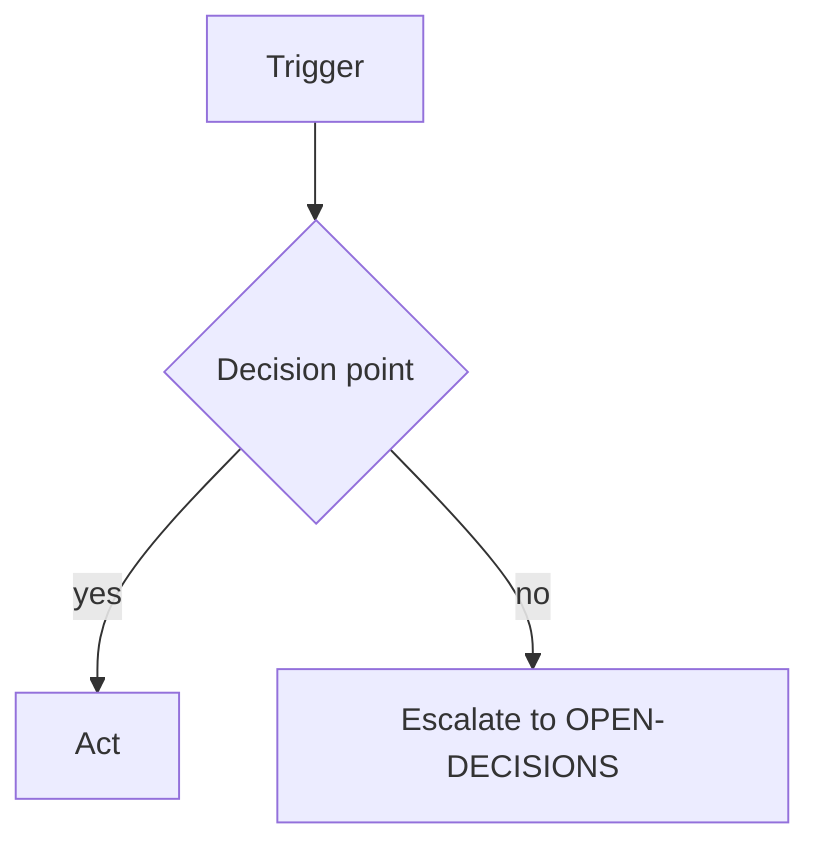

# {{unit}} — Directive

How *this* unit decides. Shape differs per unit by design.

```mermaid
graph TD
  A[Trigger] --> B{Decision point}
  B -->|yes| C[Act]
  B -->|no| D[Escalate to OPEN-DECISIONS]
```

## Decision rights
## Escalation trigger
