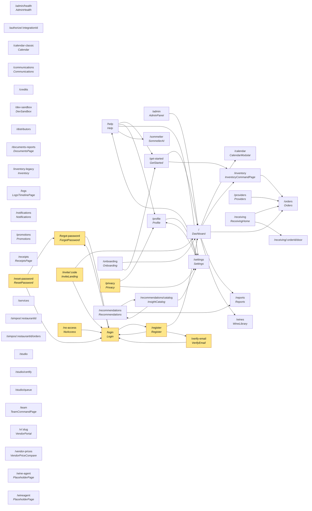

# Page Interconnection Map — Web App

> Generated 2026-08-24 from `apps/web/src/App.tsx` + page sources (`navigate()`, `<Link to>`, `href`).

**51 routes** · **39 in-app navigation edges** · 13 route components unresolved (dynamic/inline).

Yellow = unauthenticated/public entry points.

## Entry points (no inbound in-app link)

These are reached by URL, redirect, or external link — not by clicking through the app.
Each is a place a user can land cold, so each needs its own auth + empty-state handling.

- `/admin/health`
- `/authorize/:integrationId`
- `/calendar-classic`
- `/communications`
- `/credits`
- `/dev-sandbox`
- `/distributors`
- `/documents-reports`
- `/inventory-legacy`
- `/logs`
- `/notifications`
- `/promotions`
- `/receipts`
- `/services`
- `/simpos/:restaurantId`
- `/simpos/:restaurantId/orders`
- `/studio`
- `/studio/certify`
- `/studio/queue`
- `/team`
- `/v/:slug`
- `/vendor-prices`
- `/wine-agent`
- `/wineagent`

## Most-linked-to pages (in-degree)

| Page | Inbound links |
|---|---|
| `/login` | 6 |
| `/` | 5 |
| `/orders` | 4 |
| `/settings` | 4 |
| `/profile` | 3 |
| `/inventory` | 2 |
| `/reports` | 2 |
| `/get-started` | 2 |
| `/forgot-password` | 2 |
| `/calendar` | 1 |
| `/wines` | 1 |
| `/sommelier` | 1 |

## Unresolved route components

Route element could not be traced to a file (inline element, or non-standard binding). Navigation out of these pages is **not** represented in the graph above:

- `*`
- `/authorize/:integrationId`
- `/credits`
- `/distributors`
- `/receiving/:orderId/door`
- `/services`
- `/simpos/:restaurantId`
- `/simpos/:restaurantId/orders`
- `/studio`
- `/studio/certify`
- `/studio/queue`
- `/wine-agent`
- `/wineagent`