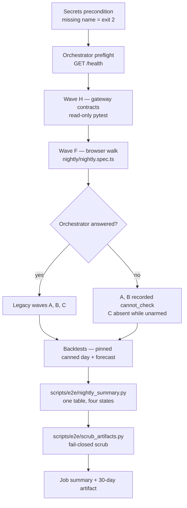

# End-to-end tests — how they work

This folder holds two suites. They share Playwright and nothing else, so never
read one's result as the other's.

| Lane | Files | Runs | Target |
|---|---|---|---|
| **Local smoke** | `auth.setup.ts`, `navigation.spec.ts`, `retired-routes.spec.ts`, `smoke.spec.ts`, `studio-flow.spec.ts` under `../playwright.config.ts` | CI job `test-e2e` (`.github/workflows/ci.yml`) on every push | A dev server CI starts, with mocked auth (`auth.setup.ts`) |
| **Nightly production** | `nightly/` under `../playwright.nightly.config.ts` | `.github/workflows/e2e-prod.yml`: cron 02:00 UTC, or started by hand | The deployed app (`https://mudavym.com`) and its gateway, as a real account |

The rest of this page is about the nightly. Its decision record is
[ADR 0135](../../../.planning/decisions/0135-the-nightly-reports-four-states-and-walks-the-gated-pages.md),
rebuilt 2026-09-16.

---

## 1. What one nightly run does



Waves D, E and G no longer exist. They were retired on 2026-09-12 because they
tested tables production does not have
([ADR 0137](../../../.planning/decisions/0137-legacy-e2e-waves-d-e-g-are-retired-not-repointed.md)).

## 2. The four states

Every check ends in exactly one of these. The summary counts each one separately.

| State | Meaning | Colour of the run |
|---|---|---|
| `pass` | The assertion held | green |
| `fail` | The assertion ran and did not hold: a production signal | red (exit 1) |
| `absent` | Something not built yet (a pending route, an unrebuilt public door), a house with nothing to open a route on, or a wave unarmed by decision (Wave C while `RABBITMQ_URL` is unset) | Reported. Never counted as a pass. |
| `cannot_check` | The check did not run: missing secret, refused house, unreachable service, a failed list read, a skipped case, a test that threw or timed out after recording, empty corpus | red on purpose (exit 2) |

**The run's verdict:** any `fail` makes it FAIL (exit 1), even when other
checks could not run; they are listed under it. With no fail, any
`cannot_check` makes it CANNOT_CHECK (exit 2). Otherwise it is PASS (exit 0).
The founder decided on 2026-09-17 that a failure is always the headline.

A page that prints its own "could not be read" sentence gets two records. The
page's honesty passes (it said so in words). The read fails (something behind
it broke). The walk never asserts on a figure.

An enrolled page (one in `MUDAVYM_PAGES`) that renders no Mudavym root with the
override on, or lands somewhere other than its route, is a **fail**, not an
absence. The manifest is held equal to `MUDAVYM_PAGES`, so the page must exist:
either it broke, or production is behind main.

## 3. What the browser walk opens

`nightly/nightly.spec.ts` runs these tests in order, on one worker:

| Test | Record ids | What it checks |
|---|---|---|
| precondition | `precondition.*` | Secrets are set. The account signs in through `/auth/login`, is verified, has a house, and that house is a **simulator house** (§5). |
| sign-in | `signin.ui`, `signin.readonly` | The real two-step login form signs the account in. Only the form's own two POSTs are let through. |
| flags | `flag.<slug>`, `flags.tally` | Reads each page's `mudavym_design_*` flag for the house. With `expect_flags=report` (the default) it reports without gating. |
| walk, override on | `page.<slug>.next`, `.reads`, `.provenance`, `pending.<slug>`, `walk.next.readonly` | Opens every page in `manifest.pages` with the Mudavym design forced on, then every `pending_pages` route. |
| walk, flag off | `page.<slug>.legacy`, `walk.legacy.readonly` | Opens every page with legacy forced, in the account's own house. A different `E2E_LEGACY_RESTAURANT_ID` is refused (`precondition.legacy_house`), because the gateway takes the house from the sign-in token. |
| public | `public.switch`, `public.<slug>.on/off`, `.honest`, `public.redirect.*` | Opens the signed-out doors three ways: as built, with ADR 0133's one switch forced on, and forced off. |

### The pages, as of 2026-09-16

- **23 gated pages** (`manifest.pages`). These are exactly `MUDAVYM_PAGES` in
  `apps/web/src/lib/mudavym/useMudavymDesign.ts`, including `/logs`, the first
  page of the new-pages wave, and `/admin` (ADR 0143 desk).
- **11 signed-out doors** (`manifest.public_pages`). On main, only `/login` and
  `/register` read the public switch (`VITE_MUDAVYM_PUBLIC`, overridden per
  browser by `localStorage["mudavym.design.public"]`). The other nine report
  `absent` until they are rebuilt. `/reset-password`, `/invite/:code` and
  `/v/:slug` are opened with a harmless invalid value and must say so in words.
- **4 pending routes** (`manifest.pending_pages`): `/promotions`,
  `/vendor-prices`, `/recommendations/catalog`, and `/ask`. They are held by
  ADR 0143's open forks and ADR 0145. The walk measures that no Mudavym root
  renders on each one; it does not take the manifest's word for it.
- `/authorize/:integrationId` must send a signed-out visitor to `/login`.

**First full run against production** (2026-09-17, from a laptop as the Sim
Bistro owner, not yet from CI): **100 pass · 2 fail · 20 absent · 0
cannot_check.** Re-run the same day on the audit-fixed code: **101 · 2 · 20 · 0**
(the extra pass is `signin.readonly`). Merged with Wave H (10 passed) and the
backtests: **FAIL, exit 1 · 135 pass · 2 fail · 22 absent · 3 cannot_check**. The
3 are the orchestrator preflight and waves A and B, which wait on F2. All 20 flags read OFF for the house. The public switch reads OFF
as built. Absent means: two parameter routes, because the house holds no order
and no document; 7 pending routes; 9 public doors not rebuilt; and the legacy
pass of the two parameter routes. Both failures are real production reads that
the pages reported in words:

| Page | What the page said | Measured cause |
|---|---|---|
| `/communications` | "Saved schedules could not be loaded" | `GET /reports/schedules` → 500: `public.scheduled_reports` does not exist in production. First seen 2026-09-11, still live. |
| `/profile` | "Your own agreement could not be read" | `GET /communications/text-senders` returns `myConsent.reason` "invalid input syntax for type uuid: \"undefined\"". `text-senders.controller.ts` reads `user.id`, but the JWT user carries `userId`. |

## 4. The files

| File | Role | Edit by hand? |
|---|---|---|
| `nightly/manifest.json` | Pages, routes, flags and each page's own sentences | Yes. The guard checks it (§6). |
| `nightly/lib.ts` | Session, pacing, classification, sim-house check, `ReadOnlyGuard` | Yes |
| `nightly/nightly.spec.ts` | The tests in §3 | Yes |
| `nightly/honest-reporter.ts` | Writes `test-results/nightly/nightly-summary.{json,md}` and `shots/` | Yes |
| `nightly/sim-houses.json` | The only houses the walk may open | Only after re-measuring (§5) |
| `nightly/design-verdicts.json` | The founder's recorded design calls | **No.** Generated (§7). |
| `../playwright.nightly.config.ts` | One worker, traces off, screenshots on failure | Yes |
| `../../../scripts/e2e/nightly_summary.py` | Merges every wave into one verdict and exit code | Yes |
| `../../../scripts/check_nightly_manifest.py` | CI guard for the manifest | Yes |
| `../../../scripts/e2e/extract_design_verdicts.py` | Generates `design-verdicts.json` | Yes |

## 5. Safety rails, and why each exists

- **Nothing secret reaches a report.** A Playwright network error ends in a
  "Call log" that lists `authorization: Bearer <jwt>`. Before 2026-09-17 that
  reached the summary and the artifact; an audit reproduced it with sentinel
  tokens. Every gateway call now goes through `gateway()` in `lib.ts`, which
  rethrows only a redacted first line. Every recorded reason and piece of
  evidence passes through `redact()`. The CI guard fails on any direct request
  call elsewhere in `nightly/`.
- **Only simulator houses, and only the token's own.** The walk screenshots
  every page into a public 30-day artifact. The gateway takes the house from
  the sign-in token and never reads `X-Restaurant-Id`. So before the sign-in
  test, the flag read and each walk, the TOKEN's house id is checked against
  `sim-houses.json`, and the gateway's branch list must name it `Sim …`. Wave H
  checks the same list. Any other answer is `cannot_check` (audit findings 1.3
  and N1).
  The gateway returns no slug, so the id list is committed. To add a house,
  re-measure with a read-only `restaurants?select=id,slug,name&slug=like.sim-*`.
  Never add one by name.
- **Writes are aborted, not just avoided.** `ReadOnlyGuard` routes every browser
  request. GET, HEAD and OPTIONS pass. So do two read-shaped POSTs: the token
  refresh and the flag read. Everything else is aborted and listed in
  `walk.*.readonly` / `public.*.readonly`. Ids in the list are folded to
  `:id`. In the first production run it aborted Sentry envelopes and one real
  write: the legacy app's `PATCH /users/:id/preferences`, sent just from
  viewing pages.
- **No traces, and none of Playwright's own output leaves the runner.**
  - A Playwright trace is a full network capture. A failed run's trace once
    carried the test password and live JWTs (audit finding 1.1), so traces
    stay `off`.
  - When a test fails, Playwright also writes `error-context.md`, which holds
    every input's value. The login page keeps a typed password on an error
    (re-audit B2, reproduced with sentinels).
  - So `apps/web/test-results/` is never uploaded, and Playwright's stdout
    goes to the job log only, where GitHub masks secrets.
  - On failure, the sign-in test empties the password field and throws only a
    scrubbed line.
  - Before any upload, `scripts/e2e/scrub_artifacts.py` removes the password,
    JWTs, bearer tokens and secret-named `name: value` pairs — the same set
    `lib.ts redact()` covers — from every file. A file that cannot be decoded
    (a truncated log, a gzip, an image) is scanned lossily and **deleted** if it
    carries a credential; a symlink fails the step. It names every file it
    redacts, deletes or refuses in `scrub-report.json` and in the job summary,
    so lost evidence is never silent. With `E2E_TEST_PASSWORD` unset it exits 2
    rather than report a set it never scanned. If anything survives, neither the
    upload nor the deploy-gate PR comment runs.
  - Screenshots carry no headers or bodies.
- **Target URLs are guarded.** The workflow refuses a local or non-https
  `E2E_BASE_URL`, where the sign-in test types the password, and the same for
  `API_GATEWAY_URL`, which receives it. A `workflow_dispatch` may only name
  hosts this repo already targets: the `API_GATEWAY_URL` secret's host for
  `api_url`, and `mudavym.com` or the Vercel host for `base_url`.
- **Secrets are step-scoped.** `E2E_TEST_EMAIL` / `E2E_TEST_PASSWORD` are
  mapped only into the steps that sign in, summarise or scrub. `SUPABASE_*`,
  `ADMIN_API_KEY` and `RABBITMQ_URL` go only into the legacy-wave steps. No
  secret is mapped into the whole job, so no install step can read one.
- **Legacy teardown is opt-in.** `tests/e2e/conftest_prod.py` deletes `sim-*`
  houses only when `E2E_SIM_TEARDOWN=1`. The workflow never sets it.
- **Auth pacing.** `/api/v1/auth/*` allows 10 requests per 60 s per IP and route.
  The walk boots the app once per pass and navigates with `pushState`. One
  `AuthBudget` shared across the worker's tests waits whenever a route nears
  the limit. A worker restart starts it empty; `walk.*.pacing` records what
  actually happened.

## 6. Adding or changing a page

1. Enrol the page in `MUDAVYM_PAGES` and register its flag, as usual.
2. Add an entry to `manifest.pages`:
   `slug`, `flag` (`mudavym_design_<slug>`), `route`, `legacy` (`page`, `same`
   or `redirect:/x`), `source` (the page's own directory), and the page's own
   sentences: `empty`, `failed_read`, optional `provenance` and `*_testids`.
   A route with a parameter needs `needs` (a list endpoint to take an id from).
3. Copy each sentence from the page's source as **one run of text**. If the page
   always renders a sentence containing a shared phrase (logs' intro says
   "could not be read"), put that sentence in `static_text`. It is removed
   before matching.
4. If the page was listed in `pending_pages`, remove it from there.
5. Run `python3 scripts/check_nightly_manifest.py`.

**Chrome is not a page.** An enrolled slug that gates something wrapping every
route (today only `shell`, the house shell) still gets an entry, with
`"chrome": true`. Both walks pin its override off and record it `absent`, and
`extract_design_verdicts.py` skips it. Forced on, its own `.mudavym` root would
make every page and every pending page read as rebuilt.

The guard runs in CI (job `decision-claims`) and fails, naming the entry, when:

- `manifest.pages` and `MUDAVYM_PAGES` differ, in either direction;
- a flag is misnamed or unregistered;
- a sentence renders from no non-test file in the page's `source` directory or
  the shared Mudavym components (a sentence that exists only in a comment also
  counts as missing);
- a testid is gone;
- a public page's `switch` does not match whether its file reads the switch;
- a pending page has enrolled;
- a file under `nightly/` calls the request fixture directly instead of
  through `gateway()` (rule 7).

**What the guard cannot see:**
- a generic sentence that a shared component also renders (for example
  "nothing here");
- a sentence split by JSX;
- a phrase inside a comment written as `"x"// phrase` or `return/* phrase */`;
- a request call made through a renamed variable (rule 7 is a text match).

Prefer sentences that belong to one state of one page.

Two more self-tests run in the same CI job: `nightly_summary.py --self-test`
(10 cases: verdict precedence, Wave C, unrecorded errors including a
parametrised one, skips, crashes, truncation, an almost-empty corpus,
redaction) and `scrub_artifacts.py --self-test` (13 cases: the password, a bare
JWT, secret-named pairs, an undecodable file, a gzip, a symlink, an unwritable
file, and refusing to run with no password). Each case was proven to fail when
the behaviour it asserts is mutated away.

## 7. The founder's recorded design calls

`design-verdicts.json` pins, per page, the call the founder recorded in the
claude.ai artifacts: Wave Four's keep/rework verdicts, the Build Board's
label and state, and The Arrival's per-direction calls. It is generated from the
ADR 0148 snapshots. It copies only the call, date and document version, never the
note text. The walk prints these calls in a separate table beside each page's
walked state. **They never pass or fail anything** (founder's call, 2026-09-16).

The snapshots are not on main yet; they are on `claude/artifact-pull`. To
regenerate:

```bash
python3 scripts/e2e/extract_design_verdicts.py --ref origin/claude/artifact-pull --write
```

```bash
python3 scripts/e2e/extract_design_verdicts.py --ref origin/claude/artifact-pull --check
```

`--check` exits 0 when the file matches, 1 on drift, and 2 when a snapshot is
missing. CLAIMS row `ADR-0135-h` fails CI on the day the snapshots reach main.
That is the prompt to wire `--check` into CI without `--ref`.

## 8. Running it

**In production (the real run).** Actions → *Production E2E Tests* → Run
workflow. Inputs: `expect_flags` (`report`/`on`/`off`), `base_url`, `api_url`.
Required secrets: `API_GATEWAY_URL`, `E2E_TEST_EMAIL`, `E2E_TEST_PASSWORD`. The
header of `e2e-prod.yml` lists every optional secret and what its absence
costs.

**Locally, signed-out doors only.** This needs no account and no gateway. It
uses system Chrome, so nothing is downloaded. Add a throwaway config beside
`playwright.nightly.config.ts` that sets `projects[0].use.channel = 'chrome'`,
then from `apps/web`:

```bash
env -u CI E2E_BASE_URL=https://mudavym.com E2E_API_URL=https://unused.invalid E2E_TEST_EMAIL=unused@example.invalid E2E_TEST_PASSWORD=unused npx playwright test --config <your throwaway config> --grep "public:"
```

**Locally, the full walk against production** (how the 2026-09-17 run was made).
Use the same throwaway config, and pass the simulator-owner credentials from
the root `.env.sim` as `E2E_TEST_EMAIL` / `E2E_TEST_PASSWORD`. Set
`E2E_API_URL=https://wineopsapi-gateway-production.up.railway.app` (the host the
production bundle calls) and `E2E_BASE_URL=https://mudavym.com`. It takes about
3 minutes. The house must be on `sim-houses.json`, or every walk is refused.

**Locally, against a local gateway** (proven 2026-09-11). Run a gateway on `:4010`, and
point `apps/web/.env.local` at it with `VITE_API_GATEWAY_URL`. Start Vite on
`127.0.0.1:5276`. Load simulator-owner credentials, then run the config with
`E2E_BASE_URL=http://127.0.0.1:5276 E2E_API_URL=http://localhost:4010`. Add
`--grep-invert sign-in` while iterating: the form test uses up the
`/auth/sign-in-methods` budget (10 requests per 10 minutes).

Results land in `apps/web/test-results/nightly/`: `nightly-summary.md`,
`nightly-summary.json` and `shots/`.

## 9. Open, and not yet proven

- **CI has never run the signed-in walk.** It has run twice from a laptop,
  on 2026-09-17 (§3). The workflow's `E2E_TEST_EMAIL` / `E2E_TEST_PASSWORD` secrets are not
  set. On 2026-09-11 `aldemirkonuk@mudavym.com` was not in `public.users` (not
  re-measured since). Setting the secrets to an account that belongs to a house
  on `sim-houses.json` is the founder's step.
- **Two production reads fail today** (§3's table). Both are product defects
  the walk reports, not suite defects.
- **Founder forks still open (ADR 0135):**
  - F1: whether to gate on flags being ON.
  - F5: flipping the sims.
  - F3, reopened 2026-09-17: a second house for the legacy pass needs a second
    account, because the gateway scopes by the token.
- **Answered but not yet actioned:** F2, retargeting the
  `RAILWAY_ORCHESTRATOR_URL` secret to the live orchestrator host. That is a
  repository-settings change for the founder. Until it happens, waves A and B
  are `cannot_check` every night; Wave C is `absent` by decision.
- The design-call snapshots live on an unmerged branch (§7).
- **These files are in no tsconfig,** so `pnpm type-check` does not see them. The
  `tsc` runs behind this suite were explicit invocations. Fixing it needs
  `@types/node` in `apps/web` — its own PR.
- **The scrub reads UTF-8 text and gzip only.** A zip, a UTF-16 log or a base64
  body would pass it. None is in the upload set today; adding one means
  teaching the scan first.
- **ADR 0149's cutover will retire parts of this suite.** It deletes `PageGate`,
  `useMudavymDesign` and the flag registry, which the flags test, the legacy
  walk, the public switch test and the guard's checks 1 and 4 all read. The
  guard will exit 2 (`MUDAVYM_PAGES not found`) the day that lands. Reworking
  this suite is the cutover's own follow-up, not something to pre-empt: until
  then both designs exist and both are walked. See ADR 0135's last section.
