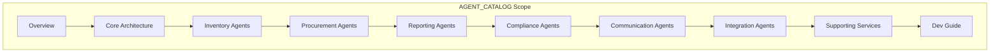

**File:** `AGENT_CATALOG_SUBPLAN.md`  
**Purpose:** Sub-detail plan for producing `md_files/AGENT_CATALOG.md`, the catalog of all Python agents.  
**Description:** This plan defines the structure for documenting the 17 WineOps AI agents by category (Inventory, Procurement, Reporting, Compliance, Communication, Integration), the base agent pattern, orchestrator integration, supporting services (email, Plivo, Toast, OCR), and an agent development guide. Use this when creating or updating AGENT_CATALOG for backend and agent developers.

---

# AGENT_CATALOG – Sub-Detail Plan

## Purpose

**AGENT_CATALOG.md** is the **definitive catalog** of all **17 Python agents** in the WineOps AI Agent Orchestrator. It groups agents by category (Inventory, Procurement, Reporting, Compliance, Communication, Integration), describes each agent’s role and responsibilities, documents the **base agent pattern** and **orchestrator** integration, and lists **supporting services** (email, Plivo, Toast, OCR, etc.). It also provides a short **Agent Development Guide** for adding or modifying agents.

---

## Project Summary

| Item | Value |
|------|--------|
| **Output** | `md_files/AGENT_CATALOG.md` |
| **Framework** | FastAPI + Python; BaseAgent, RabbitMQ, Celery |
| **Audience** | Backend and agent developers |
| **Format** | Markdown with tables and code snippets |

---

## In-Depth Explanation

### What AGENT_CATALOG Covers

1. **Overview** – Agent count by category, base pattern, human-in-the-loop, message bus, LLM use.  
2. **Core architecture** – Directory layout (`agents/`, `core/`, `services/`, `jobs/`), BaseAgent, AgentContext, AgentResult, orchestrator.  
3. **Inventory agents (5)** – InventoryEngine, GhostInventory, ShrinkageDetective, VisualVerification, InequalityDetector.  
4. **Procurement agents (4)** – Procurement, RecurringOrder, RFQ, NegotiationPlaybook.  
5. **Reporting agents (3)** – Reporting, Calendar, MenuAnalyzer.  
6. **Compliance agents (2)** – Compliance, StateInvariantEnforcer.  
7. **Communication agents (2)** – Notification, Sommelier.  
8. **Integration agents (2)** – POSIntegration, AutoPilot.  
9. **Supporting services** – TemplateEngine, EmailClient, PlivoClient, PlivoVoiceClient, ToastAPIClient, InvoiceOCRService, etc.  
10. **Agent Development Guide** – How to add an agent, extend BaseAgent, register with orchestrator, use message bus.

### Agent Categories (17 Total)

| Category | Count | Agents |
|----------|-------|--------|
| Inventory | 5 | InventoryEngine, GhostInventory, ShrinkageDetective, VisualVerification, InequalityDetector |
| Procurement | 4 | Procurement, RecurringOrder, RFQ, NegotiationPlaybook |
| Reporting | 3 | Reporting, Calendar, MenuAnalyzer |
| Compliance | 2 | Compliance, StateInvariantEnforcer |
| Communication | 2 | Notification, Sommelier |
| Integration | 2 | POSIntegration, AutoPilot |

*(Names must match `services/agent-orchestrator/agents/*.py`; include buffer_manager and similar if they are considered agents.)*

### Conventions

- **Per-agent:** Name, category, purpose, main inputs/outputs, key dependencies.  
- **BaseAgent:** Abstract base, `AgentContext`, `AgentResult`, `execute` (or similar) contract.  
- **Code snippets:** Short examples (e.g. extending BaseAgent, registering agent) only where helpful.

---

## Scope Diagram

---

## Section Breakdown

| Section | Content | Required |
|--------|---------|----------|
| **Table of Contents** | Anchors to all sections | Yes |
| **Overview** | Stats, categories, base pattern, message bus | Yes |
| **Core Architecture** | Directory structure, BaseAgent, orchestrator | Yes |
| **Inventory Agents** | All 5 with purpose and brief description | Yes |
| **Procurement Agents** | All 4 | Yes |
| **Reporting Agents** | All 3 | Yes |
| **Compliance Agents** | All 2 | Yes |
| **Communication Agents** | All 2 | Yes |
| **Integration Agents** | All 2 | Yes |
| **Supporting Services** | TemplateEngine, Email, Plivo, Toast, OCR, etc. | Yes |
| **Agent Development Guide** | How to add/extend agents | Yes |

---

## Key Content Checklist

- [ ] **All 17 agents** listed with category and purpose.  
- [ ] **BaseAgent** pattern documented (context, result, execute).  
- [ ] **Directory layout** for `agents/`, `core/`, `services/`, `jobs/`.  
- [ ] **Supporting services** table (name, purpose).  
- [ ] **Development guide** with steps to add an agent and register it.

---

## Deliverables

| Output | Path |
|--------|------|
| Agent catalog | `md_files/AGENT_CATALOG.md` |

---

## Relationship to Other Schemas

| Document | Relationship |
|----------|---------------|
| **PROGRAM_SCHEMA** | PROGRAM_SCHEMA lists agents; AGENT_CATALOG documents each. |
| **ARCHITECTURE_DIAGRAMS** | Agent Orchestration diagram aligns with catalog. |
| **API_REFERENCE** | Orchestrator HTTP endpoints may invoke agents. |
| **DATABASE_OVERVIEW** | Agents read/write tables (inventory, orders, events, etc.).

---

**Document Version:** 1.0  
**Created:** January 2026
