**File:** `API_REFERENCE_SUBPLAN.md`  
**Purpose:** Sub-detail plan for producing `md_files/API_REFERENCE.md`, the exhaustive API endpoint documentation.  
**Description:** This plan defines the module-by-module structure, endpoint table format (method, path, auth, description), and request/response examples for the NestJS API Gateway. It covers all 60+ endpoints across Auth, Dashboard, Inventory, Procurement, Reports, Toast, Events, Calendar, Inventory Ledger, Providers, Conversations, Communications, Notifications, and One-Tap Actions. Use this when creating or updating API_REFERENCE for frontend and API consumers.

---

# API_REFERENCE – Sub-Detail Plan

## Purpose

**API_REFERENCE.md** is the **exhaustive** API surface documentation for the WineOps AI NestJS Gateway. It lists **all 60+ endpoints** by module, with HTTP method, path, auth requirement, and description. For important endpoints (e.g. login, register, dashboard summary), it includes **request/response examples**. It is the primary reference for frontend and integration developers calling the API.

---

## Project Summary

| Item | Value |
|------|--------|
| **Output** | `md_files/API_REFERENCE.md` |
| **Base URL** | `http://localhost:4000` (dev); document `/api/v1` prefix where used |
| **Audience** | Frontend, mobile, and API consumers |
| **Format** | Markdown with tables and JSON examples |

---

## In-Depth Explanation

### What API_REFERENCE Covers

- **Auth:** login, register, OAuth (Google, Microsoft), refresh, logout, me, verify.  
- **Dashboard:** summary by restaurant, health check.  
- **Inventory:** CRUD, search, filters, bulk actions.  
- **Procurement:** orders, order items, status updates.  
- **Reports:** generate, list, formats.  
- **Toast:** webhooks, menu cache, orders, auth.  
- **Events:** ingest, idempotency, DLQ reference.  
- **Calendar:** events CRUD, recurrence.  
- **Inventory Ledger:** transactions, history.  
- **Providers:** CRUD, contacts, search.  
- **Conversations:** AI approval, conversation history.  
- **Communications:** templates, send, scheduled.  
- **Notifications:** list, mark read, preferences.  
- **One-Tap Actions:** list, complete, batch.

### Module–Path Mapping

| Module | Base Path | Controller Source |
|--------|-----------|-------------------|
| Auth | `/auth` | `auth.controller` |
| Dashboard | `/dashboard` | `dashboard.controller` |
| Inventory | `/inventory` or `/api/v1/inventory` | `inventory.controller` |
| Procurement | `/api/v1/procurement` | `procurement.controller` |
| Reports | `/api/v1/reports` | `reports.controller` |
| Toast | `/toast` | `toast.controller` |
| Events | `/events` | `events.controller` |
| Calendar | `/calendar` | `calendar.controller` |
| Inventory Ledger | `/inventory-ledger` | `inventory-ledger.controller` |
| Providers | `/api/v1/providers` | `providers.controller` |
| Conversations | `/api/v1/conversations` | `conversations.controller` |
| Communications | `/communications` | `communications.controller` |
| Notifications | `/api/v1/notifications` | `notifications.controller` |
| One-Tap Actions | `/one-tap-actions` | `one-tap-actions.controller` |

*(Exact paths must match `apps/api-gateway`; adjust if different.)*

### Conventions

- **Tables:** Method | Endpoint | Auth (Yes/No) | Description.  
- **Examples:** JSON request/response for login, register, dashboard summary, and other high-value endpoints.  
- **Auth note:** State that protected routes require `Authorization: Bearer <token>`.  
- **Versioning:** Document `Base URL` and any `/api/v1` (or similar) prefix.

---

## Scope Diagram

```mermaid
flowchart TB
    subgraph API[API_REFERENCE Scope]
        A[Auth]
        D[Dashboard]
        I[Inventory]
        P[Procurement]
        R[Reports]
        T[Toast]
        E[Events]
        C[Calendar]
        L[Inventory Ledger]
        Pr[Providers]
        Co[Conversations]
        Com[Communications]
        N[Notifications]
        O[One-Tap Actions]
    end
    
    A --> D --> I --> P --> R --> T --> E --> C --> L --> Pr --> Co --> Com --> N --> O
```

---

## Section Breakdown

| Section | Content | Required |
|--------|---------|----------|
| **Table of Contents** | Anchors to each module | Yes |
| **Auth** | Endpoints table + login/register examples | Yes |
| **Dashboard** | Endpoints table + summary example | Yes |
| **Inventory** | Endpoints table | Yes |
| **Procurement** | Endpoints table | Yes |
| **Reports** | Endpoints table | Yes |
| **Toast** | Endpoints table | Yes |
| **Events** | Endpoints table | Yes |
| **Calendar** | Endpoints table | Yes |
| **Inventory Ledger** | Endpoints table | Yes |
| **Providers** | Endpoints table | Yes |
| **Conversations** | Endpoints table | Yes |
| **Communications** | Endpoints table | Yes |
| **Notifications** | Endpoints table | Yes |
| **One-Tap Actions** | Endpoints table | Yes |

---

## Endpoint Table Format

Each module section uses a table like:

| Method | Endpoint | Auth | Description |
|--------|----------|------|-------------|
| POST | `/auth/login` | No | Email/password login |
| GET | `/auth/me` | Yes | Current user profile |

Plus optional **Request/Response examples** for selected endpoints.

---

## Key Content Checklist

- [ ] All 14+ modules covered.  
- [ ] 60+ endpoints documented (method, path, auth, description).  
- [ ] Auth section includes login, register, OAuth, refresh, logout, me, verify.  
- [ ] Request/response examples for login, register, dashboard summary.  
- [ ] Global note on `Authorization: Bearer` and base URL.

---

## Deliverables

| Output | Path |
|--------|------|
| API reference | `md_files/API_REFERENCE.md` |

---

## Relationship to Other Schemas

| Document | Relationship |
|----------|---------------|
| **PROGRAM_SCHEMA** | PROGRAM_SCHEMA lists modules; API_REFERENCE documents their endpoints. |
| **ARCHITECTURE_DIAGRAMS** | Data flow and auth diagrams align with API usage. |
| **DATABASE_OVERVIEW** | Many endpoints map to tables (e.g. inventory, orders, providers).

---

**Document Version:** 1.0  
**Created:** January 2026
