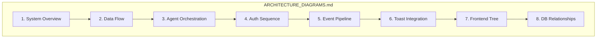

**File:** `ARCHITECTURE_DIAGRAMS_SUBPLAN.md`  
**Purpose:** Sub-detail plan for producing `md_files/ARCHITECTURE_DIAGRAMS.md`, the visual architecture reference.  
**Description:** This plan defines all Mermaid diagrams to include: system overview, data flow, agent orchestration, authentication sequence, event ingestion pipeline, Toast POS integration, frontend component tree, and database entity relationships. It specifies diagram types, conventions, and how each diagram supports PROGRAM_SCHEMA, API_REFERENCE, DATABASE_OVERVIEW, and AGENT_CATALOG. Use this when creating or updating ARCHITECTURE_DIAGRAMS.

---

# ARCHITECTURE_DIAGRAMS – Sub-Detail Plan

## Purpose

**ARCHITECTURE_DIAGRAMS.md** holds **all** system architecture diagrams in **Mermaid** format. It is the single place for visual representation of WineOps AI flows, structure, and relationships. PROGRAM_SCHEMA may include one high-level diagram; ARCHITECTURE_DIAGRAMS provides the full set. Readers use it to understand data flow, agent orchestration, auth, events, Toast integration, frontend structure, and database relationships without reading code.

---

## Project Summary

| Item | Value |
|------|--------|
| **Output** | `md_files/ARCHITECTURE_DIAGRAMS.md` |
| **Audience** | Developers, architects, technical stakeholders |
| **Format** | Markdown with Mermaid code blocks |
| **Diagram count** | 8 (or as specified below) |

---

## In-Depth Explanation

### Why a Dedicated Diagrams Document

- **Single place** for all architecture visuals.  
- **Mermaid** is plain-text, versionable, and renderable in GitHub/GitLab and many docs tools.  
- **Consistency:** Same notation (flowchart, sequence, etc.) across diagrams.  
- **Separation of concerns:** PROGRAM_SCHEMA = prose + tables; ARCHITECTURE_DIAGRAMS = diagrams.  

### Diagram Conventions

- Use **flowchart** for structure and data flow; **sequenceDiagram** for auth and request/response flows.  
- **Subgraphs** for logical layers (Frontend, Gateway, Agents, Data, External).  
- **Node IDs** in camelCase or PascalCase; no spaces. Use `["Label"]` for labels with special characters.  
- **Edges:** `-->` for flow; `-.->` for optional or reference.  
- Follow project **mermaid syntax** rules (no HTML in labels, no reserved IDs like `end`, etc.).

### What Each Diagram Conveys

1. **System Overview** – Layers and connections (Frontend ↔ Gateway ↔ Agents ↔ Data ↔ External).  
2. **Data Flow** – Request path: Client → API → Guards/Services → Orchestrator/Agents → Postgres/Redis.  
3. **Agent Orchestration** – How FastAPI, Orchestrator, RabbitMQ, Celery, and agents interact.  
4. **Authentication** – Login/OAuth → JWT issue → protected request → validation.  
5. **Event Pipeline** – Frontend/backend → POST /events → DB → Realtime → subscribers.  
6. **Toast Integration** – Webhook receive → validate → process → update DB / notify.  
7. **Frontend Tree** – High-level app structure (e.g. App → Layout → Pages → key components).  
8. **DB Relationships** – Core entities (users, restaurants, inventory, orders, etc.) and relationships.

---

## Scope Diagram

---

## Diagram Specification

| # | Name | Type | Purpose | Key Nodes |
|---|------|------|---------|-----------|
| 1 | **System Overview** | flowchart TB | Layers and connections | Frontend, Gateway, Agents, Data, External |
| 2 | **Data Flow Architecture** | flowchart LR/TB | Request path client → storage | Client, API, Guards, Services, Orchestrator, Postgres, Redis |
| 3 | **Agent Orchestration Flow** | flowchart | FastAPI ↔ Orchestrator ↔ RabbitMQ ↔ Celery ↔ Agents | FastAPI, Orchestrator, RabbitMQ, Celery, AgentPool |
| 4 | **Authentication Sequence** | sequenceDiagram | Login → JWT → protected call | Client, Auth, API, Guards |
| 5 | **Event Ingestion Pipeline** | flowchart | Events from client/backend → DB → Realtime | Client, API, Events, DB, Realtime, Subscribers |
| 6 | **Toast POS Integration** | flowchart | Webhook → validate → process | Toast, Webhook, API, DB, Agents |
| 7 | **Frontend Component Tree** | flowchart | App structure | App, Layout, Pages, key components |
| 8 | **Database Entity Relationships** | flowchart or ER-style | Tables and relations | users, restaurants, inventory, orders, etc. |

---

## Section Breakdown

| Section | Content | Required |
|--------|---------|----------|
| **Table of Contents** | Anchors to each diagram | Yes |
| **1. System Overview** | Mermaid + short caption | Yes |
| **2. Data Flow Architecture** | Mermaid + short caption | Yes |
| **3. Agent Orchestration Flow** | Mermaid + short caption | Yes |
| **4. Authentication Sequence** | Mermaid + short caption | Yes |
| **5. Event Ingestion Pipeline** | Mermaid + short caption | Yes |
| **6. Toast POS Integration** | Mermaid + short caption | Yes |
| **7. Frontend Component Tree** | Mermaid + short caption | Yes |
| **8. Database Entity Relationships** | Mermaid + short caption | Yes |

---

## Key Content Checklist

- [ ] All 8 diagrams implemented in Mermaid.  
- [ ] No syntax errors (validate in Mermaid live editor or CI).  
- [ ] Subgraphs used for layers where appropriate.  
- [ ] Node IDs and labels follow project mermaid rules.  
- [ ] Brief caption or bullet list under each diagram explaining what it shows.

---

## Deliverables

| Output | Path |
|--------|------|
| Architecture diagrams | `md_files/ARCHITECTURE_DIAGRAMS.md` |

---

## Relationship to Other Schemas

| Document | Relationship |
|----------|---------------|
| **PROGRAM_SCHEMA** | PROGRAM_SCHEMA describes layers in prose; ARCHITECTURE_DIAGRAMS draws them. |
| **API_REFERENCE** | Data flow and auth diagrams align with API module and auth endpoints. |
| **DATABASE_OVERVIEW** | DB Relationships diagram aligns with DATABASE_OVERVIEW tables. |
| **AGENT_CATALOG** | Agent Orchestration diagram aligns with agent list and message bus.

---

**Document Version:** 1.0  
**Created:** January 2026
