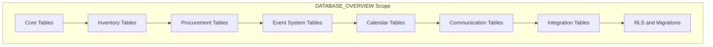

**File:** `DATABASE_OVERVIEW_SUBPLAN.md`  
**Purpose:** Sub-detail plan for producing `md_files/DATABASE_OVERVIEW.md`, the database schema documentation.  
**Description:** This plan defines table groups (core, inventory, procurement, event system, calendar, communication, integration), schema documentation format, Row Level Security, and migrations. It specifies what to document for each group—purpose, key columns, relationships—without replacing full DDL in DATABASE_SCHEMA.sql or migrations. Use this when creating or updating DATABASE_OVERVIEW for backend and database work.

---

# DATABASE_OVERVIEW – Sub-Detail Plan

## Purpose

**DATABASE_OVERVIEW.md** documents the **Supabase PostgreSQL** schema used by WineOps AI. It groups tables by domain (core, inventory, procurement, events, calendar, communication, integration), describes each table’s purpose and main columns, and covers **Row Level Security (RLS)** and **migrations**. It is the primary reference for backend and database work. Full DDL lives in migration files and `DATABASE_SCHEMA.sql`; DATABASE_OVERVIEW provides a readable, navigable overview.

---

## Project Summary

| Item | Value |
|------|--------|
| **Output** | `md_files/DATABASE_OVERVIEW.md` |
| **Database** | Supabase PostgreSQL (30+ tables) |
| **Audience** | Backend developers, DBAs, architects |
| **Format** | Markdown with tables, optional SQL snippets |

---

## In-Depth Explanation

### What DATABASE_OVERVIEW Covers

1. **Overview** – Table counts by group, multi-tenant model (`restaurant_id`), RLS, soft deletes, audit columns.  
2. **Core tables** – users, restaurants, user_restaurant_access, plus any tenant/org tables.  
3. **Inventory tables** – master_wine_library, restaurant_inventory, inventory_transactions, inventory_ledger.  
4. **Procurement tables** – providers, procurement_orders, procurement_order_items, recurring_orders.  
5. **Event system** – events, event_dead_letters, event_replay_jobs, event_schema_registry.  
6. **Calendar** – calendar_events, recurrence_rules.  
7. **Communication** – notifications, email_templates, manager_preferences, etc.  
8. **Integration** – toast-related, conversations, any provider/POS mapping tables.  
9. **RLS** – How `user_restaurant_access` and policies enforce tenant isolation.  
10. **Migrations** – List of migration files (`001_...`, `002_...`, etc.) and what each adds.

### What It Does Not Replace

- **Full DDL** – Remain in `md_files/02-architecture/DATABASE_SCHEMA.sql` and `services/database/migrations/`.  
- **API payloads** – API_REFERENCE and DTOs define request/response shapes.

### Conventions

- **Table sections:** Purpose, key columns (name, type, brief description), and notable indexes/FKs.  
- **Optional:** Short `CREATE TABLE`-like snippets for critical tables.  
- **Relationships:** Describe FKs and main relationships; ARCHITECTURE_DIAGRAMS can show ER-style diagram.

---

## Scope Diagram

---

## Table Groups

| Group | Tables | Purpose |
|-------|--------|---------|
| **Core** | users, restaurants, user_restaurant_access, … | Tenants, users, access |
| **Inventory** | master_wine_library, restaurant_inventory, inventory_transactions, inventory_ledger | Catalog, stock, ledger |
| **Procurement** | providers, procurement_orders, procurement_order_items, recurring_orders | Suppliers, orders, recurrences |
| **Event System** | events, event_dead_letters, event_replay_jobs, event_schema_registry | Ingestion, DLQ, replay |
| **Calendar** | calendar_events, recurrence_rules | Events, recurrence |
| **Communication** | notifications, email_templates, manager_preferences, … | Alerts, templates, prefs |
| **Integration** | toast_*, conversations, … | POS, AI conversations |

---

## Section Breakdown

| Section | Content | Required |
|--------|---------|----------|
| **Table of Contents** | Anchors to each section | Yes |
| **Overview** | Stats, multi-tenant, RLS, soft deletes, audit | Yes |
| **Core Tables** | users, restaurants, user_restaurant_access, etc. | Yes |
| **Inventory Tables** | master_wine_library, restaurant_inventory, … | Yes |
| **Procurement Tables** | providers, orders, items, recurring | Yes |
| **Event System Tables** | events, DLQ, replay, schema registry | Yes |
| **Calendar Tables** | calendar_events, recurrence_rules | Yes |
| **Communication Tables** | notifications, templates, prefs | Yes |
| **Integration Tables** | toast, conversations, etc. | Yes |
| **Row Level Security** | RLS model, key policies | Yes |
| **Migrations** | List of migration files and summary | Yes |

---

## Key Content Checklist

- [ ] **Overview** with table counts and feature list (multi-tenant, RLS, soft deletes).  
- [ ] **Each table group** documented with purpose and main columns.  
- [ ] **RLS** section describing tenant isolation and `user_restaurant_access`.  
- [ ] **Migrations** section listing `001_` … `009_` (or current) and brief summary.

---

## Deliverables

| Output | Path |
|--------|------|
| Database overview | `md_files/DATABASE_OVERVIEW.md` |

---

## Relationship to Other Schemas

| Document | Relationship |
|----------|---------------|
| **PROGRAM_SCHEMA** | PROGRAM_SCHEMA summarizes table groups; DATABASE_OVERVIEW details them. |
| **ARCHITECTURE_DIAGRAMS** | DB Relationships diagram aligns with DATABASE_OVERVIEW. |
| **API_REFERENCE** | Endpoints map to tables (inventory, orders, providers, etc.). |
| **02-architecture/DATABASE_SCHEMA.sql** | Source of truth for DDL; OVERVIEW summarizes.

---

**Document Version:** 1.0  
**Created:** January 2026
