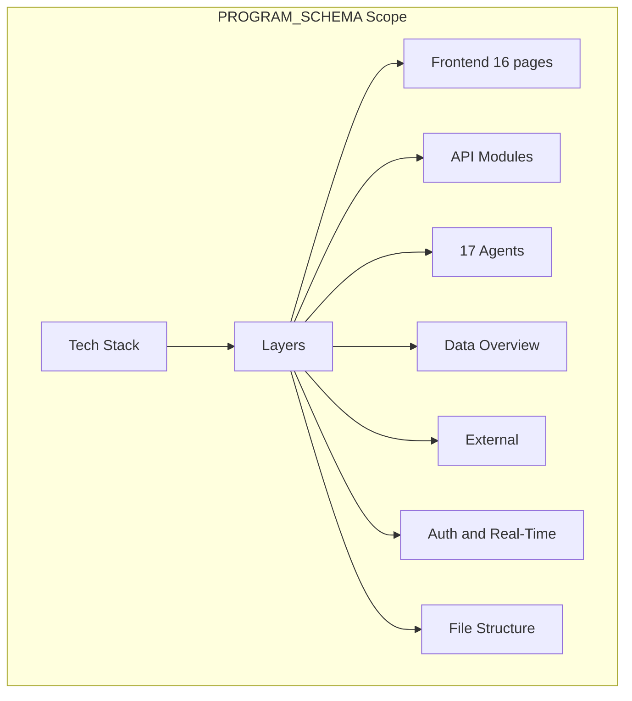

**File:** `PROGRAM_SCHEMA_SUBPLAN.md`  
**Purpose:** Sub-detail plan for producing `md_files/PROGRAM_SCHEMA.md`, the system-wide architecture reference.  
**Description:** This plan specifies the structure, section breakdown, and content requirements for PROGRAM_SCHEMA. It covers the technology stack, frontend (16 pages, contexts), API gateway (modules, auth), agent orchestrator (17 agents, services), data layer (table groups), external integrations, authentication, real-time events, and repository file structure. Use this when creating or revising PROGRAM_SCHEMA to ensure complete, consistent system documentation.

---

# PROGRAM_SCHEMA – Sub-Detail Plan

## Purpose

**PROGRAM_SCHEMA.md** is the **single source of truth** for WineOps AI system architecture. It provides a high-level, readable overview of the entire platform: frontend, API gateway, agent orchestrator, data layer, external services, auth, and real-time events. It does **not** replace API_REFERENCE (endpoint-level detail), DATABASE_OVERVIEW (table-level detail), or AGENT_CATALOG (agent-level detail); it **orchestrates** them by naming modules, agents, and tables and linking to those documents where appropriate.

---

## Project Summary

| Item | Value |
|------|--------|
| **Output** | `md_files/PROGRAM_SCHEMA.md` |
| **Audience** | Developers, architects, new joiners |
| **Depth** | System-wide; module/agent/table names and roles, not full API or DDL |
| **Format** | Markdown with tables, code blocks, optional Mermaid |

---

## In-Depth Explanation

### What PROGRAM_SCHEMA Covers

1. **Technology stack** – Frameworks, languages, databases, queues, external APIs.  
2. **Layered architecture** – Frontend → API Gateway → Agent Orchestrator → Data → External.  
3. **Frontend** – All 16 pages (routes), key React contexts (Auth, Realtime, Theme, Toast).  
4. **API Gateway** – All NestJS modules, base paths, purpose; auth (JWT, OAuth, guards).  
5. **Agent Orchestrator** – All 17 agents by category; supporting services (email, Plivo, Toast, etc.).  
6. **Data layer** – Logical table groups (core, procurement, events, calendar, etc.); Supabase + Redis.  
7. **External integrations** – Toast, Plivo, Gmail, Sentry.  
8. **Authentication & security** – JWT structure, roles, tenant isolation, rate limiting.  
9. **Real-time** – Event types, flow (frontend → API → DB → Realtime → clients).  
10. **File structure** – Top-level repo layout (`apps/`, `services/`, `packages/`, `md_files/`).

### What It Does Not Cover

- **Per-endpoint specs** → API_REFERENCE  
- **Per-table DDL and relationships** → DATABASE_OVERVIEW  
- **Per-agent implementation details** → AGENT_CATALOG  
- **Mermaid-only visual flows** → ARCHITECTURE_DIAGRAMS (PROGRAM_SCHEMA may include one overview diagram).

### Conventions

- Use **tables** for modules, pages, agents, tables.  
- Use **bullets** for features and capabilities.  
- Keep **code blocks** minimal (e.g. JWT payload, small ASCII architecture).  
- Version and “Last Updated” at top; “Document Version” at bottom.

---

## Scope Diagram

---

## Section Breakdown

| Section | Content | Required |
|--------|---------|----------|
| **Table of Contents** | Anchors to all major sections | Yes |
| **Executive Summary** | 2–3 paragraphs; key metrics (pages, modules, endpoints, agents, tables) | Yes |
| **Technology Stack** | Tables: Frontend, API Gateway, Agents, Data, External | Yes |
| **System Architecture** | ASCII or Mermaid; layers and connections | Yes |
| **Frontend Layer** | Page table (route, description); context table | Yes |
| **API Gateway Layer** | Module table (name, path, purpose); auth, guards | Yes |
| **Agent Orchestrator Layer** | Agent table (name, category, purpose); services table | Yes |
| **Data Layer** | Table groups (core, procurement, events, etc.); not full DDL | Yes |
| **External Integrations** | Toast, Plivo, Gmail, Sentry with 1–2 line description each | Yes |
| **Authentication & Security** | JWT structure, roles, security layers | Yes |
| **Real-Time Event System** | Event types, high-level flow | Yes |
| **File Structure** | Tree of `apps/`, `services/`, `packages/`, `md_files/` | Yes |

---

## Key Content Checklist

- [ ] **Metrics table:** Frontend pages, API modules, endpoints, agents, DB tables, integrations.  
- [ ] **Module table:** Auth, Dashboard, Inventory, Procurement, Reports, Toast, Events, Calendar, Inventory Ledger, Providers, Conversations, Communications, Notifications, One-Tap Actions, etc.  
- [ ] **Agent table:** All 17 agents with category and purpose.  
- [ ] **Data table groups:** Core, Procurement, Event System, Calendar, Communication, Integration.  
- [ ] **JWT payload example** (minimal).  
- [ ] **Event types** (inventory_change, order_change, etc.).  
- [ ] **Repository file structure** (top-level only).

---

## Deliverables

| Output | Path |
|--------|------|
| Program schema | `md_files/PROGRAM_SCHEMA.md` |

---

## Relationship to Other Schemas

| Document | Relationship |
|----------|---------------|
| **ARCHITECTURE_DIAGRAMS** | PROGRAM_SCHEMA summarizes; ARCHITECTURE_DIAGRAMS provides all Mermaid flows. |
| **API_REFERENCE** | PROGRAM_SCHEMA lists modules and paths; API_REFERENCE documents every endpoint. |
| **DATABASE_OVERVIEW** | PROGRAM_SCHEMA lists table groups; DATABASE_OVERVIEW has full schemas and RLS. |
| **AGENT_CATALOG** | PROGRAM_SCHEMA lists agents; AGENT_CATALOG has full agent docs. |

---

**Document Version:** 1.0  
**Created:** January 2026
