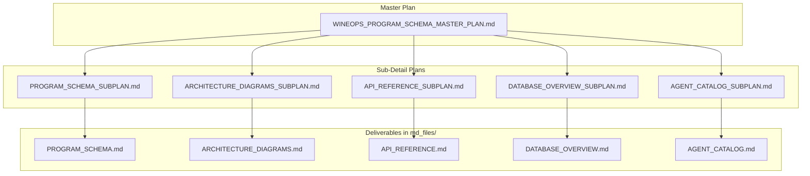
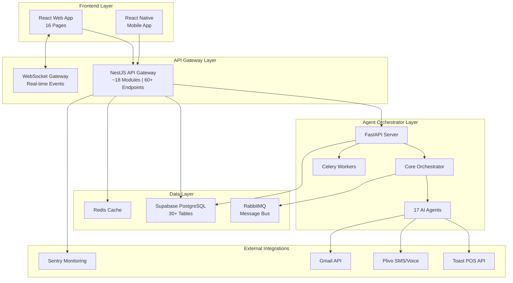
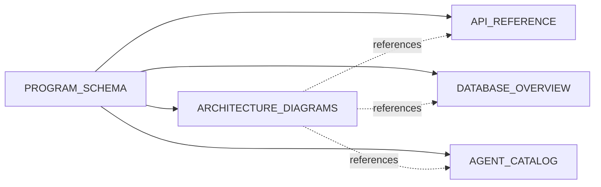

**File:** `WINEOPS_PROGRAM_SCHEMA_MASTER_PLAN.md`  
**Purpose:** Master plan that orchestrates the full program schema initiative and all sub-detail plans.  
**Description:** This document provides a complete view of the WineOps Program Schema effort: system-level scope, the five deliverable schemas and their roles, links to each sub-plan, execution order, and where every artifact lives (`md_files/` and `md_files/06-planning/`). It includes Mermaid diagrams for scope, system boundaries, and dependencies. Read this first when creating or updating architecture documentation; then use the linked sub-plans for each deliverable.

---

# WineOps AI – Program Schema Master Plan

## Purpose

This master plan provides a **full, comprehensive understanding** of the WineOps Program Schema initiative. It expands the original program-schema plan into:

1. **System-level scope** – What the full schema covers and why it exists  
2. **Deliverable breakdown** – Five distinct schema documents and their roles  
3. **Sub-detail plans** – In-depth, schema-style plans for each deliverable (same format as this document)  
4. **Execution order and dependencies** – How sub-plans relate and in what sequence to execute them  

All deliverable files are written to **`md_files/`**. Sub-plan schemas live in **`md_files/06-planning/`**.

---

## Project Summary

**WineOps AI** is a production-ready (v2.6.0) restaurant wine inventory and procurement automation platform. The program schema initiative **reconstructs and documents** the complete system architecture so that:

- New developers can onboard from a single, authoritative source  
- Architecture decisions (APIs, agents, data model) are explicit and traceable  
- Diagrams, endpoints, tables, and agents are discoverable without traversing the entire codebase  
- The system remains maintainable as it evolves (new modules, agents, tables)  

The schema **does not implement** features; it **describes** the existing system in a structured, consistent way.

---

## Scope Overview

| Layer | Description |
|-------|-------------|
| **Master Plan** | This document. Defines scope, deliverables, and references all sub-plans. |
| **Sub-Plans** | One schema per deliverable. In-depth explanations, section breakdowns, mermaid diagrams, content checklists. Same structure as the original wineops_program_schema plan. |
| **Deliverables** | The actual documentation files (PROGRAM_SCHEMA, ARCHITECTURE_DIAGRAMS, API_REFERENCE, DATABASE_OVERVIEW, AGENT_CATALOG). |

---

## System Boundaries (What the Schema Documents)

The schema documents the **as-built** system across four layers:

| Layer | Documented In | Key Artifacts |
|-------|----------------|---------------|
| **Frontend** | PROGRAM_SCHEMA, ARCHITECTURE_DIAGRAMS | 16 pages, contexts, design system |
| **API Gateway** | PROGRAM_SCHEMA, API_REFERENCE, ARCHITECTURE_DIAGRAMS | Modules, 60+ endpoints, auth, WebSocket |
| **Agent Orchestrator** | PROGRAM_SCHEMA, AGENT_CATALOG, ARCHITECTURE_DIAGRAMS | 17 agents, services, Celery, RabbitMQ |
| **Data** | PROGRAM_SCHEMA, DATABASE_OVERVIEW, ARCHITECTURE_DIAGRAMS | 30+ tables, RLS, migrations |
| **External** | PROGRAM_SCHEMA, API_REFERENCE | Toast, Plivo, Gmail, Sentry |

---

## The Five Deliverables

### 1. PROGRAM_SCHEMA.md

**Role:** Single source of truth for **system-wide** architecture.  
**Content:** Tech stack, frontend pages, API modules, agent list, data layer overview, auth, real-time, external integrations, file layout.  
**Sub-Plan:** [PROGRAM_SCHEMA_SUBPLAN.md](./PROGRAM_SCHEMA_SUBPLAN.md)

### 2. ARCHITECTURE_DIAGRAMS.md

**Role:** Visual representation of flows and structure.  
**Content:** Mermaid diagrams for system overview, data flow, agent orchestration, auth sequence, event pipeline, Toast integration, frontend tree, DB relationships.  
**Sub-Plan:** [ARCHITECTURE_DIAGRAMS_SUBPLAN.md](./ARCHITECTURE_DIAGRAMS_SUBPLAN.md)

### 3. API_REFERENCE.md

**Role:** Exhaustive API surface documentation.  
**Content:** All 60+ endpoints by module (Auth, Dashboard, Inventory, Procurement, Reports, Toast, Events, Calendar, Inventory Ledger, Providers, Conversations, Communications, Notifications, One-Tap Actions), with method, path, auth, and request/response examples.  
**Sub-Plan:** [API_REFERENCE_SUBPLAN.md](./API_REFERENCE_SUBPLAN.md)

### 4. DATABASE_OVERVIEW.md

**Role:** Schema and relationship documentation.  
**Content:** Core, inventory, procurement, event-system, calendar, communication, integration tables; RLS; migrations; indexes.  
**Sub-Plan:** [DATABASE_OVERVIEW_SUBPLAN.md](./DATABASE_OVERVIEW_SUBPLAN.md)

### 5. AGENT_CATALOG.md

**Role:** Complete catalog of Python agents.  
**Content:** All 17 agents by category (Inventory, Procurement, Reporting, Compliance, Communication, Integration), base agent pattern, directory layout, supporting services, development guide.  
**Sub-Plan:** [AGENT_CATALOG_SUBPLAN.md](./AGENT_CATALOG_SUBPLAN.md)

---

## Technology Stack (Summary)

| Layer | Technology | Purpose |
|-------|------------|---------|
| Frontend | React 18 + TypeScript | Web UI |
| Frontend | Tailwind + Framer Motion | Styling / Animation |
| API Gateway | NestJS + TypeScript | REST API |
| Agents | FastAPI + Python | AI orchestration |
| Database | Supabase PostgreSQL | Persistence |
| Cache | Redis | Performance |
| Queue | RabbitMQ + Celery | Background jobs |
| POS | Toast API | Restaurant integration |
| Comms | Plivo + Gmail | SMS / Email |
| Monitoring | Sentry | Errors / performance |

---

## Execution Order and Dependencies

- **PROGRAM_SCHEMA** should be completed first; it defines the shared vocabulary (modules, agents, tables) used elsewhere.  
- **ARCHITECTURE_DIAGRAMS**, **API_REFERENCE**, **DATABASE_OVERVIEW**, and **AGENT_CATALOG** can be produced in parallel once PROGRAM_SCHEMA is stable. They may cross-reference each other (e.g. diagrams referencing API modules or DB tables).

---

## Sub-Plan Schema Format

Each sub-plan follows the **same schema format** as the original `wineops_program_schema_533e0f21.plan.md`:

1. **YAML frontmatter** – `name`, `overview`, `todos` (with ids and status), `isProject`  
2. **Title and purpose** – What the deliverable is and why it exists  
3. **Project summary** – Brief context  
4. **Mermaid diagrams** – Where helpful (scope, structure, data flow)  
5. **Structured sections** – Breakdown of sections to include  
6. **Tables** – e.g. modules, endpoints, tables, agents  
7. **Deliverables** – Explicit output paths (e.g. `md_files/PROGRAM_SCHEMA.md`)  
8. **In-depth explanations** – Rationale, conventions, and how the deliverable fits into the larger schema  

---

## Deliverables and Paths

| Deliverable | Path | Produced By |
|-------------|------|-------------|
| Master Plan | `md_files/06-planning/WINEOPS_PROGRAM_SCHEMA_MASTER_PLAN.md` | This document |
| PROGRAM_SCHEMA sub-plan | `md_files/06-planning/PROGRAM_SCHEMA_SUBPLAN.md` | Sub-detail plan |
| ARCHITECTURE_DIAGRAMS sub-plan | `md_files/06-planning/ARCHITECTURE_DIAGRAMS_SUBPLAN.md` | Sub-detail plan |
| API_REFERENCE sub-plan | `md_files/06-planning/API_REFERENCE_SUBPLAN.md` | Sub-detail plan |
| DATABASE_OVERVIEW sub-plan | `md_files/06-planning/DATABASE_OVERVIEW_SUBPLAN.md` | Sub-detail plan |
| AGENT_CATALOG sub-plan | `md_files/06-planning/AGENT_CATALOG_SUBPLAN.md` | Sub-detail plan |
| PROGRAM_SCHEMA | `md_files/PROGRAM_SCHEMA.md` | PROGRAM_SCHEMA sub-plan |
| ARCHITECTURE_DIAGRAMS | `md_files/ARCHITECTURE_DIAGRAMS.md` | ARCHITECTURE_DIAGRAMS sub-plan |
| API_REFERENCE | `md_files/API_REFERENCE.md` | API_REFERENCE sub-plan |
| DATABASE_OVERVIEW | `md_files/DATABASE_OVERVIEW.md` | DATABASE_OVERVIEW sub-plan |
| AGENT_CATALOG | `md_files/AGENT_CATALOG.md` | AGENT_CATALOG sub-plan |

---

## Success Criteria

- **Master plan:** Clear scope, enumerated deliverables, and links to all sub-plans.  
- **Sub-plans:** Each has a schema-compliant structure (frontmatter, diagrams, sections, tables, deliverables) and in-depth rationale.  
- **Deliverables:** PROGRAM_SCHEMA, ARCHITECTURE_DIAGRAMS, API_REFERENCE, DATABASE_OVERVIEW, and AGENT_CATALOG are complete, consistent with the codebase, and aligned with their sub-plans.

---

**Document Version:** 1.0  
**Created:** January 2026
