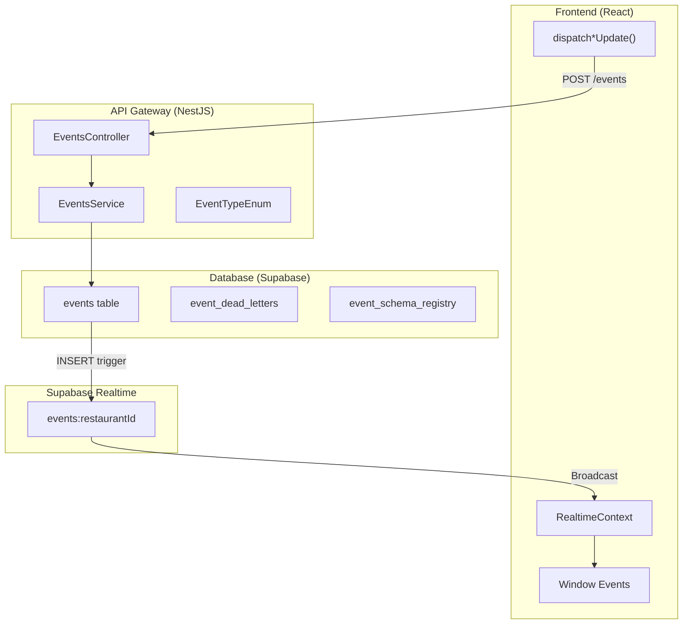
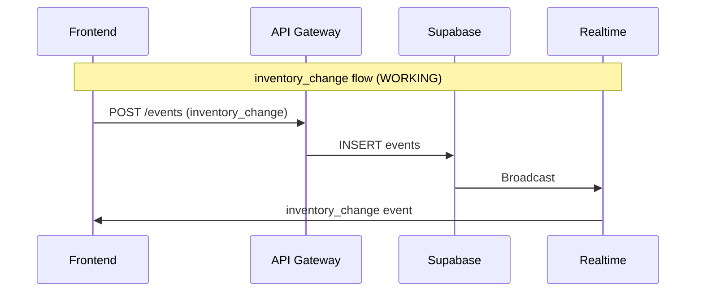
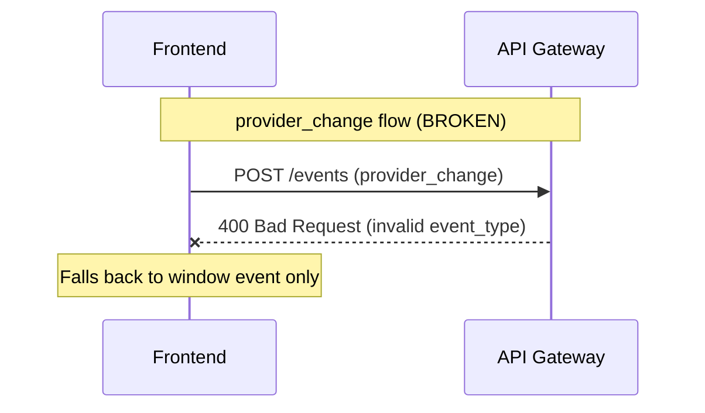

# Sync Features Backend Correspondence Analysis

## Executive Summary

The frontend defines **11 event types** with **8 dispatch functions**. The backend events system exists but has **critical gaps** - specifically, 2 recently-added event types (`provider_change`, `template_change`) are **NOT supported by the backend enum**.

---

## 1. Architecture Overview



---

## 2. Event Type Comparison Matrix

| Event Type | Frontend Dispatch | Frontend Usage | Backend Enum | Backend Emits | Status |

|------------|------------------|----------------|--------------|---------------|--------|

| `inventory_change` | `dispatchInventoryUpdate` | 6 locations | YES | Inventory Ledger | FULL SUPPORT |

| `order_change` | `dispatchOrderUpdate` | 3 locations | YES | (none) | PARTIAL |

| `calendar_event` | `dispatchCalendarEvent` | 4 locations | YES | Calendar Service | FULL SUPPORT |

| `dashboard_update` | `dispatchDashboardUpdate` | 0 locations | YES | (none) | UNUSED |

| `wine_update` | `dispatchWineUpdate` | 1 location | YES | (none) | PARTIAL |

| `report_event` | `dispatchReportEvent` | 0 locations | YES | (none) | UNUSED |

| `notification_sent` | (none) | - | YES | (none) | NO FRONTEND |

| `user_action` | (none) | - | YES | (none) | NO FRONTEND |

| `system_event` | (none) | - | YES | (none) | NO FRONTEND |

| `provider_change` | `dispatchProviderUpdate` | 1 location | **NO** | (none) | **BROKEN** |

| `template_change` | `dispatchTemplateUpdate` | 0 locations | **NO** | (none) | **BROKEN** |

---

## 3. Critical Gaps Identified

### Gap 1: Missing Backend Event Types (CRITICAL)

The frontend added `provider_change` and `template_change` events, but the backend enum does NOT include them.

**Backend Enum** in [`apps/api-gateway/src/events/dto/event.dto.ts`](apps/api-gateway/src/events/dto/event.dto.ts):

```typescript
export enum EventType {
  INVENTORY_CHANGE = 'inventory_change',
  ORDER_CHANGE = 'order_change',
  CALENDAR_EVENT = 'calendar_event',
  DASHBOARD_UPDATE = 'dashboard_update',
  WINE_UPDATE = 'wine_update',
  REPORT_EVENT = 'report_event',
  NOTIFICATION_SENT = 'notification_sent',
  USER_ACTION = 'user_action',
  SYSTEM_EVENT = 'system_event',
  // MISSING: provider_change
  // MISSING: template_change
}
```

**Impact**: When frontend calls `POST /events` with `eventType: 'provider_change'`, the backend will likely return a 400 Bad Request (DTO validation failure).

### Gap 2: Unused Dispatch Functions

Three dispatch functions are defined but never called anywhere:

- `dispatchDashboardUpdate` - 0 usages
- `dispatchReportEvent` - 0 usages  
- `dispatchTemplateUpdate` - 0 usages

### Gap 3: Missing Frontend Dispatch Functions

Three event types exist in backend but have no frontend dispatch:

- `notification_sent`
- `user_action`
- `system_event`

### Gap 4: Backend Services Not Emitting Events

While the backend can receive events, most services don't emit them:

- Providers service: No event emission
- Orders/Procurement service: No event emission
- Wine Library: No dedicated backend (frontend-only)

Only these backend services emit events:

- Calendar Service - emits `calendar_event`
- Inventory Ledger Service - emits `inventory_change`
- Conversations Service - publishes to external RabbitMQ

---

## 4. Files Requiring Changes

### Backend Changes Needed

1. **[`apps/api-gateway/src/events/dto/event.dto.ts`](apps/api-gateway/src/events/dto/event.dto.ts)**

   - Add `PROVIDER_CHANGE = 'provider_change'` to EventType enum
   - Add `TEMPLATE_CHANGE = 'template_change'` to EventType enum

2. **[`services/database/migrations/003_add_events_table.sql`](services/database/migrations/003_add_events_table.sql)**

   - Update `event_type` enum to include new types

3. **[`apps/api-gateway/src/providers/providers.service.ts`](apps/api-gateway/src/providers/providers.service.ts)**

   - Add event emission when providers are created/updated/deleted

4. **[`apps/api-gateway/src/procurement/procurement.service.ts`](apps/api-gateway/src/procurement/procurement.service.ts)**

   - Add event emission when orders change status

### Frontend Changes Needed (Optional)

5. **Remove unused dispatch functions OR add usage:**

   - `dispatchDashboardUpdate` - wire up or remove
   - `dispatchReportEvent` - wire up or remove

---

## 5. Working vs Broken Sync Flows

### Working Flows



### Broken Flows



---

## 6. Recommended Fixes

### Priority 1: Add Missing Event Types to Backend

```typescript
// apps/api-gateway/src/events/dto/event.dto.ts
export enum EventType {
  // ... existing types ...
  PROVIDER_CHANGE = 'provider_change',
  TEMPLATE_CHANGE = 'template_change',
}
```
```sql
-- New migration file
ALTER TYPE event_type ADD VALUE 'provider_change';
ALTER TYPE event_type ADD VALUE 'template_change';
```

### Priority 2: Add Event Emission to Backend Services

Providers service should emit events:

```typescript
// In providers.service.ts create() method
await this.eventsService.createEvent({
  eventType: 'provider_change',
  sourcePage: 'providers',
  payload: { type: 'added', providerId, providerName },
});
```

### Priority 3: Clean Up Unused Code

Either wire up or remove unused dispatch functions to reduce code complexity.

---

## 7. Summary Statistics

| Category | Count |

|----------|-------|

| Total Frontend Event Types | 11 |

| Backend-Supported Event Types | 9 |

| **Unsupported Event Types** | **2** |

| Frontend Dispatch Functions | 8 |

| Used Dispatch Functions | 5 |

| Unused Dispatch Functions | 3 |

| Backend Services Emitting Events | 2 |
