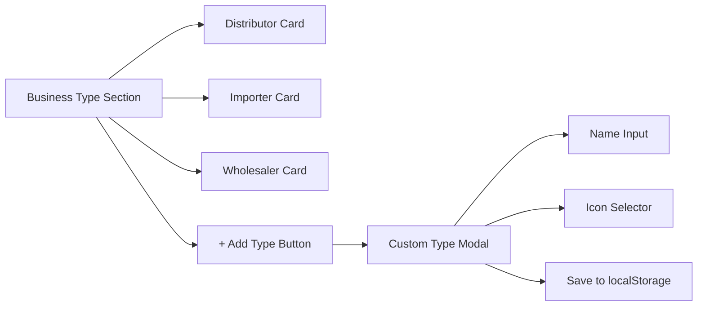
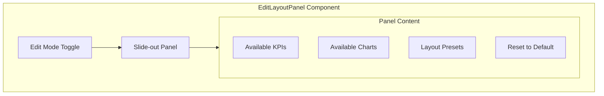
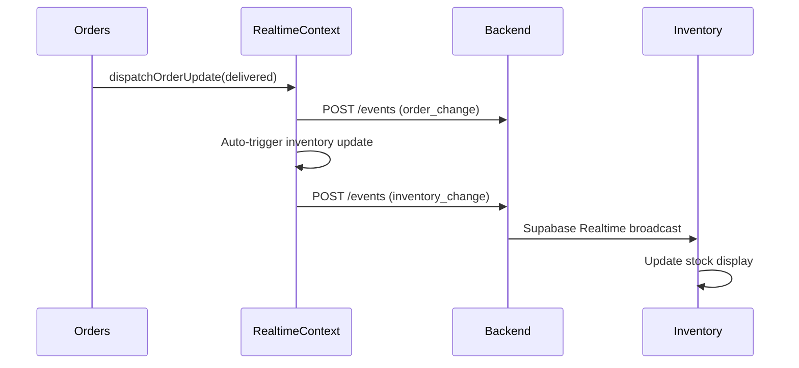
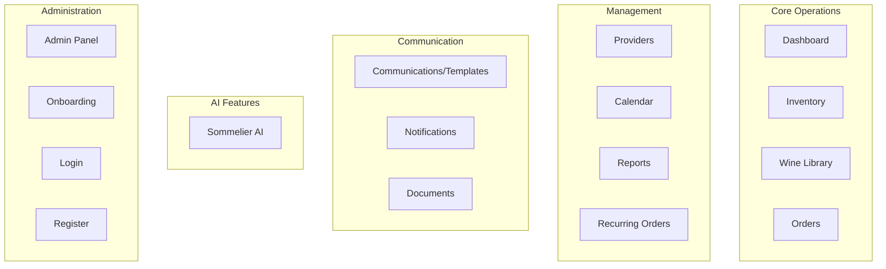
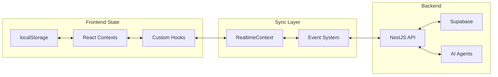

# UI Enhancements, Syncing & Information Architecture

## Summary

This plan addresses 6 areas:

1. Add custom provider type functionality
2. Create unified edit layout component (combining edit mode + chart arrangement)
3. Verify and fix cross-page syncing (Orders -> Inventory, Wine Library -> Inventory)
4. Add button in Gmail templates section
5. Audit all syncing mechanisms
6. Analyze Information Architecture

---

## 1. Add Provider Type Button in Modal

**Current State**: `primaryBusinessType` is limited to 3 hardcoded options (Distributor, Importer, Wholesaler)

**Location**: [`apps/web/src/components/providers/AddProviderModal.tsx`](apps/web/src/components/providers/AddProviderModal.tsx)

**Changes Required**:

- Add "Add Type" button next to the 3 business type cards
- Create modal/popover for adding custom type
- Store custom types in localStorage and persist to API when available
- Add icons dropdown for custom types



---

## 2. Unified Edit Layout Component

**Current State**: Reports.tsx has separate:

- `isEditMode` toggle (line 328)
- `ChartArrangementModal` (line 334)
- TopBar with both buttons

**Location**: [`apps/web/src/components/reports/`](apps/web/src/components/reports/)

**Create New Component**: `EditLayoutPanel.tsx`

Features to combine:

- Toggle edit mode (iOS-style wobble animation already exists)
- Drag-and-drop KPI cards (dnd-kit)
- Chart arrangement in a side panel (not separate modal)
- Add/remove KPIs
- Resize widgets
- Save/reset layout to localStorage



**Key Files to Create/Modify**:

- Create: `apps/web/src/components/reports/EditLayoutPanel.tsx`
- Modify: `apps/web/src/pages/Reports.tsx` - replace separate controls
- Modify: `apps/web/src/components/reports/organisms/TopBar.tsx` - simplify

---

## 3. Cross-Page Syncing Audit

### 3.1 Orders -> Inventory Sync

**Current Flow** (already implemented in RealtimeContext.tsx lines 481-492):



**Status**: Implemented but needs verification

- Check: When order marked "delivered", does inventory update?
- Check: Is `quantity` being passed correctly?

### 3.2 Wine Library -> Inventory Sync

**Current Flow**:

- `AddToInventoryFromLibraryModal` component exists
- Uses `dispatchInventoryUpdate` and `dispatchWineUpdate`

**Location**: [`apps/web/src/components/wines/AddToInventoryFromLibraryModal.tsx`](apps/web/src/components/wines/AddToInventoryFromLibraryModal.tsx)

**Status**: Verify the modal properly dispatches events

### 3.3 Missing Syncs to Add

| Source | Target | Event Type | Status |

|--------|--------|------------|--------|

| Orders (delivered) | Inventory | inventory_change | Exists |

| Wine Library (add) | Inventory | inventory_change | Exists |

| Inventory (update) | Dashboard | dashboard_update | Missing |

| Calendar (delivery) | Orders | order_change | Missing |

| Providers (new) | Orders dropdown | provider_change | Missing |

---

## 4. Gmail Templates Button

**Current State**: Communications.tsx has "Create Email Template" button

**Location**: [`apps/web/src/pages/Communications.tsx`](apps/web/src/pages/Communications.tsx) (lines 210-218)

**Add**: Secondary action button options:

- "Import Template" - load from file/preset
- "Quick Templates" - dropdown with common templates
- "AI Generate" - generate template with AI

---

## 5. Syncing Implementation Details

### RealtimeContext Enhancement

Add new event types:

- `provider_change` - when provider added/updated
- `template_change` - when template saved

**Location**: [`apps/web/src/contexts/RealtimeContext.tsx`](apps/web/src/contexts/RealtimeContext.tsx)

Add new dispatch functions:

```typescript
dispatchProviderUpdate: (payload: ProviderUpdatePayload) => Promise<void>
dispatchTemplateUpdate: (payload: TemplateUpdatePayload) => Promise<void>
```

### Inventory Subscription Enhancement

Ensure Inventory.tsx properly subscribes to updates from:

- Orders page (delivery confirmation)
- Wine Library (add to inventory)
- Manual adjustments

---

## 6. Information Architecture Analysis

### Current Page Structure (16 pages)



### Data Flow Architecture



### Key Information Flows

| Data | Source | Destinations | Sync Method |

|------|--------|--------------|-------------|

| Wine Stock | Inventory | Dashboard, Wine Library, Orders | RealtimeContext |

| Orders | Orders | Inventory, Calendar, Dashboard | RealtimeContext |

| Providers | Providers | Orders, Wine Library | localStorage + API |

| Calendar Events | Calendar | Dashboard, Notifications | RealtimeContext |

| Templates | Communications | Reports, Notifications | localStorage |

---

## Implementation Priority

1. **High Priority** - Syncing fixes (Orders -> Inventory, Wine Library -> Inventory)
2. **Medium Priority** - Provider type button, Gmail template button
3. **Lower Priority** - Unified Edit Layout Component (larger refactor)

---

## Files to Create/Modify

| File | Action | Purpose |

|------|--------|---------|

| `AddProviderModal.tsx` | Modify | Add custom type functionality |

| `EditLayoutPanel.tsx` | Create | Unified edit component |

| `Reports.tsx` | Modify | Use EditLayoutPanel |

| `RealtimeContext.tsx` | Modify | Add new event types |

| `Communications.tsx` | Modify | Add template buttons |

| `Inventory.tsx` | Verify | Ensure subscriptions work |

| `Orders.tsx` | Verify | Ensure delivery sync works |
