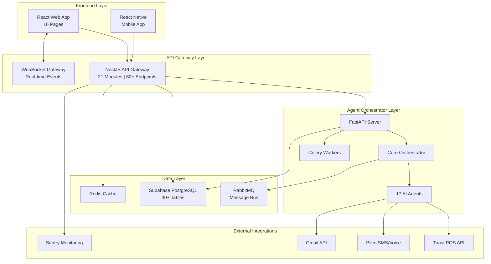

**File:** `wineops_program_schema_533e0f21.plan.md`  
**Purpose:** Root plan for the WineOps AI program schema initiative.  
**Description:** This plan defines the creation of a comprehensive program schema and system documentation for the WineOps AI Restaurant Automation platform. It specifies five deliverables (PROGRAM_SCHEMA, ARCHITECTURE_DIAGRAMS, API_REFERENCE, DATABASE_OVERVIEW, AGENT_CATALOG), the technology stack, and a high-level system architecture overview. Use this as the original reference for the schema effort; the master plan and sub-plans expand it with detailed execution and structure.

---

# WineOps AI - Comprehensive Program Schema and Documentation

## Project Summary

WineOps AI is a production-ready (v2.6.0) restaurant wine inventory and procurement automation platform. The system crashed due to heavy C++ package downloads, and workspace storage was deleted. This documentation reconstructs the complete system architecture.

---

## System Architecture Overview

---

## Key Files to Create

### 1. PROGRAM_SCHEMA.md

Complete system architecture with:

- Technology stack breakdown
- All 21 NestJS modules and their endpoints
- All 17 Python agents and their purposes
- Database schema overview (30+ tables)
- Authentication flow
- Real-time event system

### 2. ARCHITECTURE_DIAGRAMS.md

Mermaid diagrams for:

- System overview (above)
- Data flow (frontend to database)
- Agent orchestration flow
- Authentication sequence
- Event ingestion pipeline
- Toast POS integration

### 3. API_REFERENCE.md

All 60+ API endpoints grouped by module:

- Auth, Dashboard, Inventory, Procurement
- Reports, Toast, Calendar, Events
- Providers, Notifications, Communications

### 4. DATABASE_OVERVIEW.md

Tables and relationships:

- Core tables (users, restaurants, inventory)
- Event system (events, dead_letters, replay_jobs)
- Integrations (toast_*, provider_*)

---

## Technology Stack

| Layer | Technology | Purpose |

|-------|------------|---------|

| Frontend | React 18 + TypeScript | Web UI |

| Frontend | Tailwind + Framer Motion | Styling/Animation |

| API Gateway | NestJS + TypeScript | REST API |

| Agents | FastAPI + Python | AI Orchestration |

| Database | Supabase PostgreSQL | Persistence |

| Cache | Redis | Performance |

| Queue | RabbitMQ + Celery | Background Jobs |

| POS | Toast API | Restaurant Integration |

| Comms | Plivo + Gmail | SMS/Email |

---

## Deliverables

All files will be saved to:

`/Restaurant AI Automation/md_files/`

1. `PROGRAM_SCHEMA.md` - Complete system documentation
2. `ARCHITECTURE_DIAGRAMS.md` - Visual architecture
3. `API_REFERENCE.md` - All endpoints documented
4. `DATABASE_OVERVIEW.md` - Schema documentation
5. `AGENT_CATALOG.md` - All 17 agents documented
