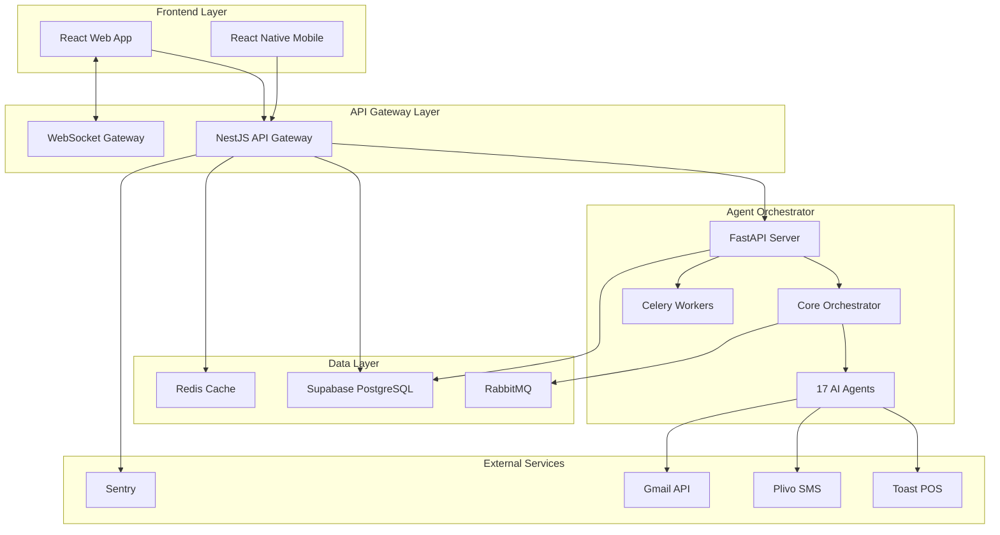
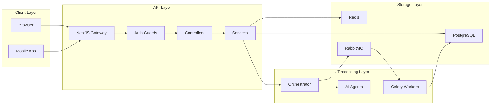
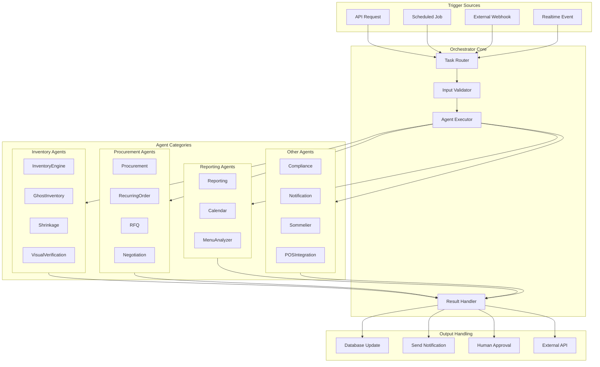
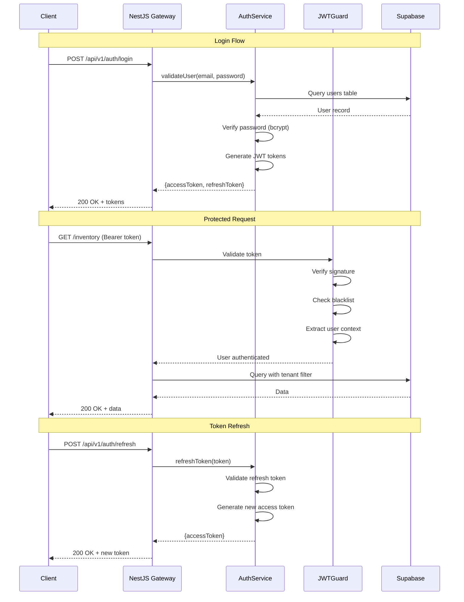
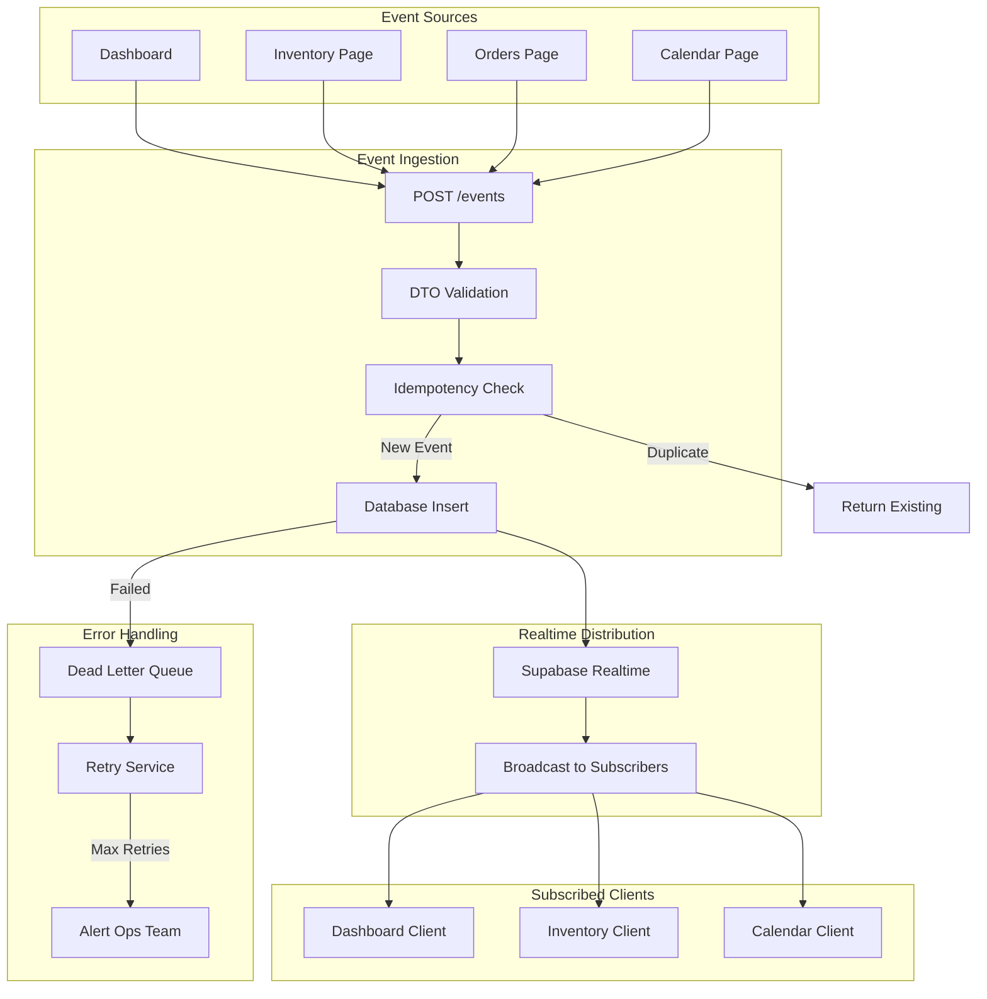
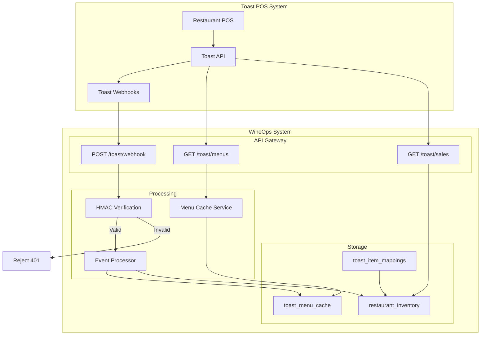
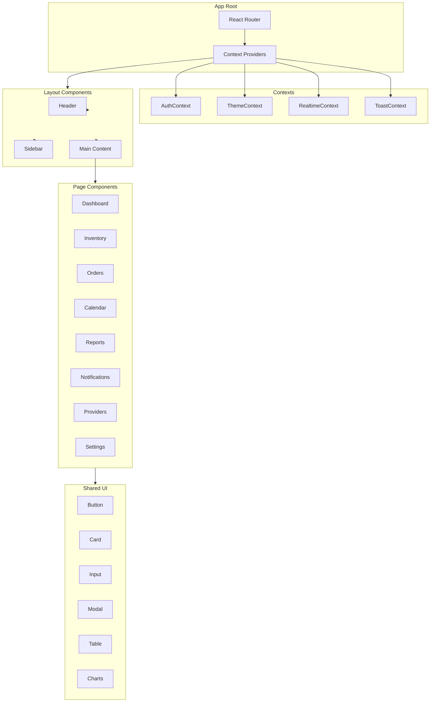
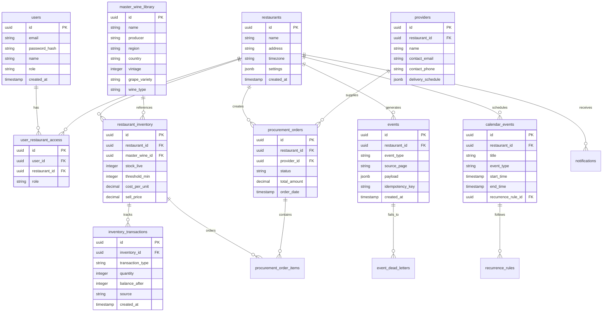
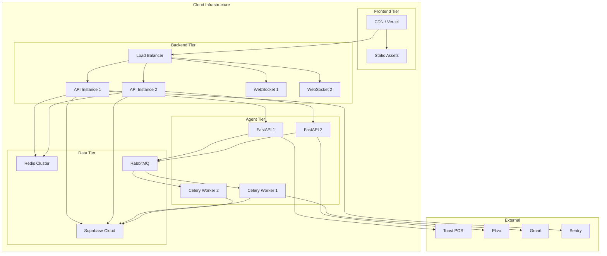
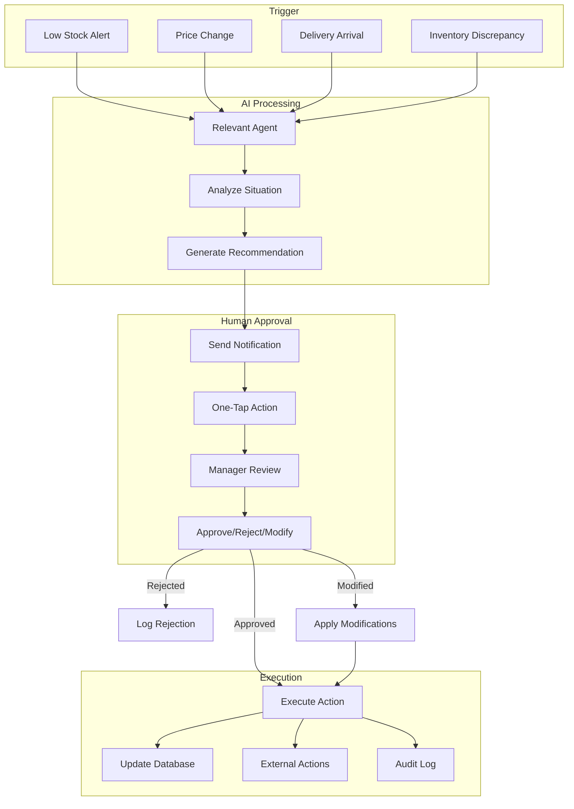

# WineOps AI - Architecture Diagrams

**Version**: 2.6.0  
**Last Updated**: January 2026

This document contains all system architecture diagrams in Mermaid format.

---

## Table of Contents

1. [System Overview](#1-system-overview)
2. [Data Flow Architecture](#2-data-flow-architecture)
3. [Agent Orchestration Flow](#3-agent-orchestration-flow)
4. [Authentication Sequence](#4-authentication-sequence)
5. [Event Ingestion Pipeline](#5-event-ingestion-pipeline)
6. [Toast POS Integration](#6-toast-pos-integration)
7. [Frontend Component Tree](#7-frontend-component-tree)
8. [Database Entity Relationships](#8-database-entity-relationships)

---

## 1. System Overview

---

## 2. Data Flow Architecture

---

## 3. Agent Orchestration Flow

---

## 4. Authentication Sequence

---

## 5. Event Ingestion Pipeline

---

## 6. Toast POS Integration

---

## 7. Frontend Component Tree

---

## 8. Database Entity Relationships

---

## 9. Deployment Architecture

---

## 10. Human-in-the-Loop Workflow

---

**Document Version**: 1.0  
**Created**: January 2026  
**Diagrams**: Mermaid format (compatible with GitHub, Notion, Obsidian)
