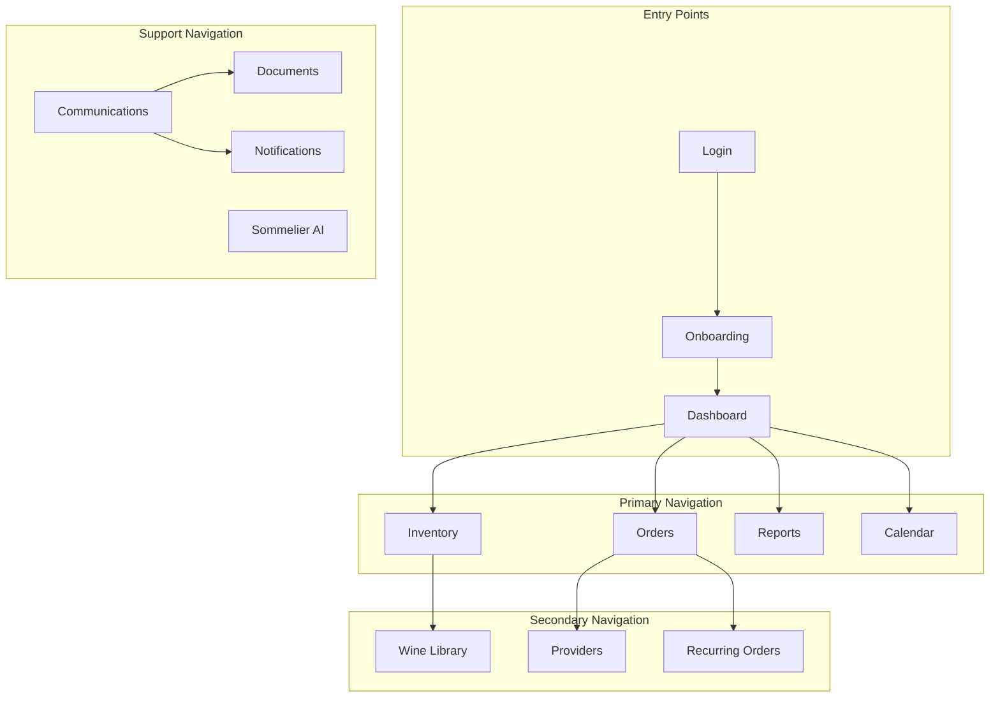
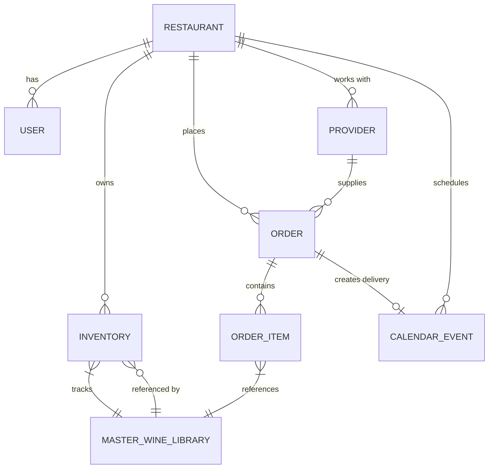
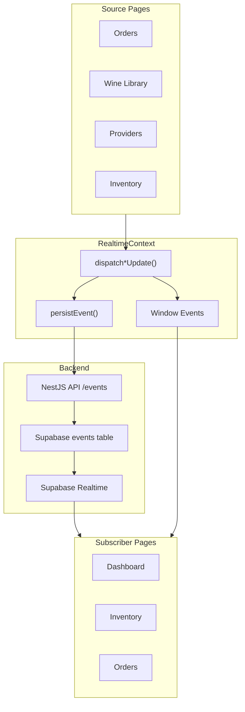

# WineOps Information Architecture

> Comprehensive analysis of the WineOps AI platform's information structure, navigation patterns, and data flows.

## Overview

This document provides a detailed analysis of how information is organized, connected, and flows through the WineOps platform. The Information Architecture (IA) defines how users navigate the system, how data is structured, and how different components communicate.

---

## 1. Application Structure

### 1.1 Page Hierarchy (16 Pages)

```
WineOps Application
├── Auth Layer
│   ├── Login
│   ├── Register
│   └── Onboarding (multi-step wizard)
│
├── Core Operations
│   ├── Dashboard (home/overview)
│   ├── Inventory (stock management)
│   ├── Wine Library (master catalog)
│   └── Orders (procurement)
│
├── Business Management
│   ├── Providers (vendor directory)
│   ├── Calendar (scheduling)
│   ├── Reports & Analytics
│   └── Recurring Orders
│
├── Communication Hub
│   ├── Communications (templates)
│   ├── Notifications
│   └── Documents
│
├── AI Features
│   └── Sommelier AI (conversational)
│
└── Administration
    └── Admin Panel
```

### 1.2 Navigation Flow



---

## 2. Data Architecture

### 2.1 Core Data Entities

| Entity | Primary Key | Parent Entity | Description |
|--------|-------------|---------------|-------------|
| `restaurants` | `id` | - | Multi-tenant root |
| `users` | `id` | `restaurants` | User accounts |
| `master_wine_library` | `id` | - | Wine catalog |
| `inventory` | `id` | `restaurants` | Active stock |
| `orders` | `id` | `restaurants` | Purchase orders |
| `providers` | `id` | `restaurants` | Vendor directory |
| `calendar_events` | `id` | `restaurants` | Scheduled events |
| `events` | `id` | `restaurants` | Event log (sync) |

### 2.2 Data Relationships



### 2.3 Data Flow Patterns

#### Pattern 1: Wine Addition Flow
```
Wine Library → AddToInventoryModal → dispatchInventoryUpdate → Inventory Page
                                   → RealtimeContext → Backend Events Table
```

#### Pattern 2: Order Delivery Flow
```
Orders Page → Mark Delivered → dispatchOrderUpdate → RealtimeContext
                            → Auto-trigger dispatchInventoryUpdate
                            → Inventory Page (stock increase)
```

#### Pattern 3: Provider Sync Flow
```
Providers Page → Add Provider → dispatchProviderUpdate → Orders Page (dropdown)
                             → RealtimeContext → Backend Events Table
```

---

## 3. Page-Level Information Architecture

### 3.1 Dashboard

**Purpose**: Central hub providing overview of operations

**Key Information Blocks**:
| Block | Data Source | Update Frequency |
|-------|-------------|------------------|
| KPI Summary | Multiple APIs | Real-time |
| Important Dates | Calendar | Real-time |
| Quick Actions | Static config | - |
| Recent Activity | Events table | Real-time |
| Low Stock Alerts | Inventory | Real-time |

**User Actions Available**:
- Navigate to detailed pages
- Quick-add reminders
- Acknowledge alerts
- Access one-tap actions

### 3.2 Inventory

**Purpose**: Manage wine stock levels and locations

**Information Hierarchy**:
```
Inventory
├── Summary Stats (total items, value, alerts)
├── Filter Controls
│   ├── Wine Type (Red/White/Sparkling/Rosé/Dessert)
│   ├── Stock Status (Critical/Low/Healthy)
│   └── Active Status (Active/Inactive)
├── Inventory Grid/List
│   └── Per Item:
│       ├── Wine Details (from Library)
│       ├── Live Stock Count
│       ├── Shadow Stock Count
│       ├── Threshold Settings
│       ├── Storage Location
│       └── Last Counted Date
└── Batch Actions
    ├── Add from Library
    ├── Export
    └── Reconciliation
```

**Sync Subscriptions**:
- `useTypedInventorySubscription` - Receives updates from Orders, Wine Library

### 3.3 Orders

**Purpose**: Create, track, and manage purchase orders

**Information Hierarchy**:
```
Orders
├── Status Tabs (Pending/Approved/Delivered/All)
├── Order Type Filter (One-time/Recurring)
├── Orders List
│   └── Per Order:
│       ├── Order ID
│       ├── Provider Info
│       ├── Wine Details
│       ├── Quantity & Cost
│       ├── Status & Timeline
│       └── Actions (Approve/Deliver/Cancel)
├── Create Order Flow
│   ├── Provider Selection
│   ├── Wine Selection
│   ├── Quantity Input
│   ├── Delivery Date
│   └── Confirmation
└── Order Templates
```

**Outgoing Sync**:
- `dispatchOrderUpdate` - Notifies Inventory on delivery

### 3.4 Wine Library

**Purpose**: Master catalog of available wines

**Information Hierarchy**:
```
Wine Library
├── Search & Filters
├── View Modes (Grid/List)
├── Wine Collection
│   └── Per Wine:
│       ├── Basic Info (Name, Producer, Vintage)
│       ├── Classification (Type, Region, Country)
│       ├── Pricing (Cost, Menu Price)
│       ├── Provider Details
│       ├── Inventory Status (if tracked)
│       └── Actions
│           ├── Add to Inventory
│           ├── Edit Details
│           └── Remove
├── Bulk Actions
└── Photo Upload (Dev Mode)
```

**Outgoing Sync**:
- `dispatchInventoryUpdate` - When adding wine to inventory
- `dispatchWineUpdate` - When wine details change

### 3.5 Providers

**Purpose**: Vendor/supplier directory management

**Information Hierarchy**:
```
Providers
├── Filter Controls
│   ├── Business Type (Distributor/Importer/Wholesaler/Custom)
│   ├── Rating Filter
│   └── Search
├── Provider Cards/List
│   └── Per Provider:
│       ├── Business Info
│       ├── Contact Details
│       ├── Specialties
│       ├── Payment Terms
│       ├── Delivery Days
│       ├── Rating
│       └── Order History
├── Add Provider Modal
│   ├── Business Type Selection (with custom types)
│   ├── Contact Information
│   ├── Business Details
│   └── Terms & Logistics
└── Provider Details View
```

**Outgoing Sync**:
- `dispatchProviderUpdate` - When provider added/updated

### 3.6 Reports & Analytics

**Purpose**: Business intelligence and performance tracking

**Information Hierarchy**:
```
Reports
├── Time Range Controls (7D/30D/90D)
├── Edit Layout Panel (NEW)
│   ├── Edit Mode Toggle
│   ├── Charts Section (drag-and-drop)
│   ├── Presets (Default/Compact/Presentation/Dashboard)
│   └── Save/Reset
├── KPI Cards (configurable)
├── Charts Grid
│   ├── Revenue Trend
│   ├── Wine Distribution
│   ├── Orders by Type
│   └── Top Wines
├── AI Insights Section
├── Report Generator
└── Data Tables
    ├── Daily Breakdown
    ├── Purchased Wines
    └── Check Scanner
```

### 3.7 Communications

**Purpose**: Email/SMS template management and history

**Information Hierarchy**:
```
Communications
├── Tab Navigation (Templates/History/Scheduled)
├── Email Templates Section
│   ├── Create Button (Primary)
│   ├── Secondary Actions (NEW)
│   │   ├── Import Template
│   │   ├── Quick Templates
│   │   └── AI Generate
│   └── Saved Templates List
├── SMS Templates Section
│   ├── Create Button
│   └── Saved Templates List
├── Communication History
└── Report Scheduler
```

---

## 4. Cross-Page Data Synchronization

### 4.1 Event System Architecture



### 4.2 Event Types Matrix

| Event Type | Source Pages | Target Pages | Payload Type |
|------------|--------------|--------------|--------------|
| `inventory_change` | Wine Library, Orders | Inventory, Dashboard | `InventoryUpdatePayload` |
| `order_change` | Orders | Inventory, Calendar, Dashboard | `OrderUpdatePayload` |
| `calendar_event` | Calendar, Orders | Dashboard, Notifications | `CalendarEventPayload` |
| `dashboard_update` | Multiple | Dashboard | `DashboardUpdatePayload` |
| `wine_update` | Wine Library, Inventory | Wine Library | `WineUpdatePayload` |
| `provider_change` | Providers | Orders | `ProviderUpdatePayload` |
| `template_change` | Communications | Communications | `TemplateUpdatePayload` |
| `report_event` | Reports | Dashboard | `ReportEventPayload` |

### 4.3 Subscription Hooks

```typescript
// Available subscription hooks
useInventorySubscription(callback)      // General inventory changes
useTypedInventorySubscription(callback) // Typed inventory updates
useOrdersSubscription(callback)         // Order changes
useCalendarEventsSubscription(callback) // Calendar events
useDashboardSubscription(callback)      // Dashboard updates
useWineSubscription(callback)           // Wine library updates
useProviderSubscription(callback)       // Provider changes
useTemplateSubscription(callback)       // Template changes
useReportSubscription(callback)         // Report events
```

---

## 5. User Flows

### 5.1 Primary User Flows

#### Flow 1: Daily Check-in
```
Login → Dashboard → Review KPIs → Check Low Stock Alerts
      → Navigate to Inventory (if needed) → Adjust stock
      → Check Calendar → Review upcoming deliveries
```

#### Flow 2: Place Order
```
Dashboard/Inventory → Orders → Create New Order
                            → Select Provider
                            → Select Wine(s)
                            → Set Quantity & Date
                            → Submit → Order Created
```

#### Flow 3: Receive Delivery
```
Orders → Find Order → Mark as Delivered
       → Auto-sync → Inventory stock updated
       → Calendar → Delivery event marked complete
```

#### Flow 4: Add New Wine
```
Wine Library → Add Wine
            → Enter Details / Photo Upload
            → Assign Provider
            → Add to Inventory (optional)
            → Sync to Inventory page
```

### 5.2 Administrative Flows

#### Flow: Customize Reports Dashboard
```
Reports → Open Edit Layout Panel
        → Toggle Edit Mode
        → Drag/reorder charts
        → Adjust chart sizes
        → Apply preset (optional)
        → Save Changes
```

#### Flow: Create Communication Template
```
Communications → Choose: Create / Import / Quick / AI
              → Edit in Template Builder
              → Add dynamic variables
              → Preview
              → Save Template
```

---

## 6. State Management

### 6.1 State Layers

| Layer | Technology | Purpose | Persistence |
|-------|------------|---------|-------------|
| Local Component | `useState` | UI state | None |
| Page Context | `useCallback`, `useMemo` | Derived data | None |
| Global Context | `RealtimeContext` | Cross-page sync | Events table |
| Browser Storage | `localStorage` | User preferences | Browser |
| Server State | Supabase/API | Source of truth | Database |

### 6.2 Key Contexts

```
App
├── AuthContext (user, session, authentication)
├── RealtimeProvider (subscriptions, dispatch functions)
└── Various Page-Level State
```

---

## 7. Design System Integration

### 7.1 Component Architecture

```
atoms/           → Basic building blocks (Button, Input, Badge)
molecules/       → Composite components (KPICard, ChartCard)
organisms/       → Complex sections (TopBar, KPISection, ChartsGrid)
templates/       → Page layouts
pages/           → Full page components
```

### 7.2 Common UI Patterns

| Pattern | Usage | Examples |
|---------|-------|----------|
| Card Grid | Item collections | Inventory, Providers, Wine Library |
| Filter Bar | Data filtering | All list pages |
| Modal Forms | Data entry | Add Provider, Add Wine |
| Slide Panels | Secondary content | Edit Layout Panel |
| Toast Notifications | Feedback | Success/Error messages |
| Drag & Drop | Reordering | Charts, KPIs in edit mode |

---

## 8. Future Considerations

### 8.1 Planned Enhancements

1. **Unified Search** - Global search across all entities
2. **Command Palette** - Keyboard-driven navigation
3. **Breadcrumb Navigation** - Context-aware path display
4. **Recent Items** - Quick access to recently viewed entities
5. **Favorites/Bookmarks** - User-curated quick links

### 8.2 Scalability Considerations

- **Pagination** - Implement for large datasets (>100 items)
- **Virtual Scrolling** - For long lists
- **Lazy Loading** - Defer non-critical content
- **Route-based Code Splitting** - Already implemented with React Router

---

## Appendix A: Page URL Structure

| Page | Route | Parameters |
|------|-------|------------|
| Login | `/login` | - |
| Register | `/register` | - |
| Onboarding | `/onboarding` | - |
| Dashboard | `/` or `/dashboard` | - |
| Inventory | `/inventory` | `?filter=`, `?search=` |
| Wine Library | `/wine-library` | `?view=`, `?type=` |
| Orders | `/orders` | `?status=`, `?type=` |
| Providers | `/providers` | `?type=`, `?rating=` |
| Calendar | `/calendar` | `?view=month|week|day` |
| Reports | `/reports` | `?range=` |
| Communications | `/communications` | `?tab=` |
| Documents | `/documents` | - |
| Notifications | `/notifications` | - |
| Sommelier AI | `/sommelier` | - |
| Admin | `/admin` | - |

---

## Appendix B: Key Metrics

| Metric | Location | Update Method |
|--------|----------|---------------|
| Total Inventory Value | Dashboard, Reports | Real-time calc |
| Low Stock Count | Dashboard, Inventory | Threshold comparison |
| Pending Orders | Dashboard, Orders | Status filter |
| Monthly Revenue | Dashboard, Reports | Aggregation |
| Top Selling Wines | Reports | Order data analysis |
| Provider Performance | Providers, Reports | Delivery metrics |

---

*Last Updated: January 2026*
*Version: 1.0*
